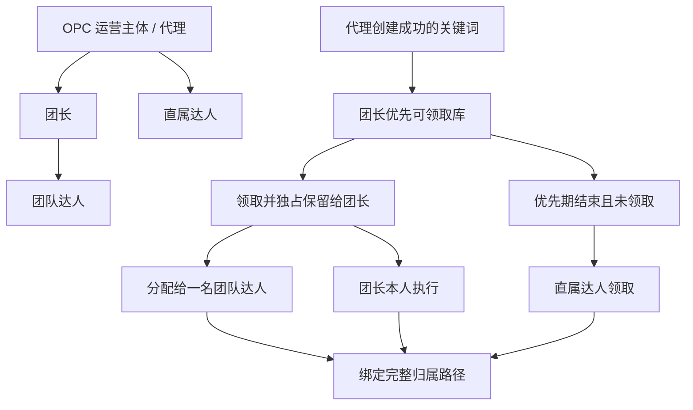
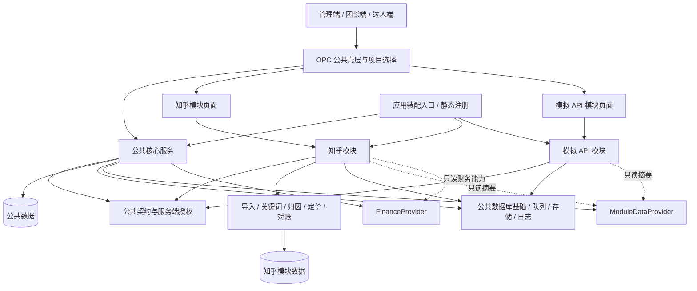
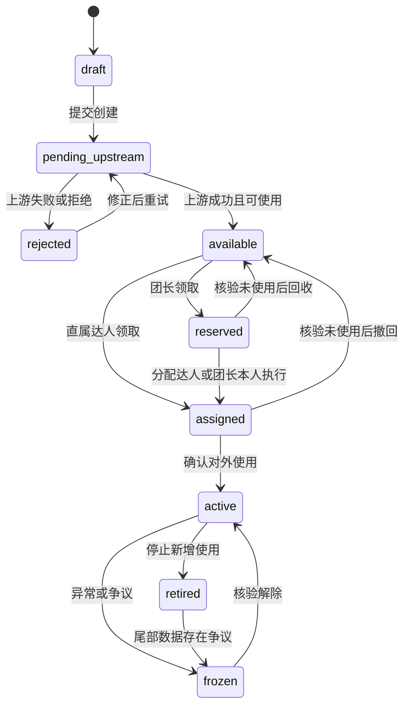
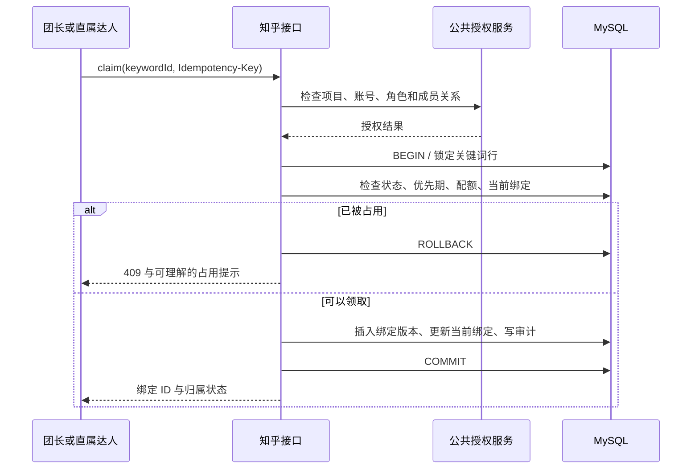
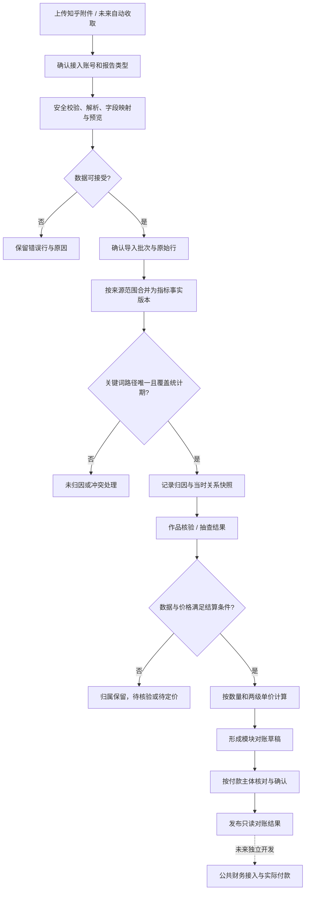
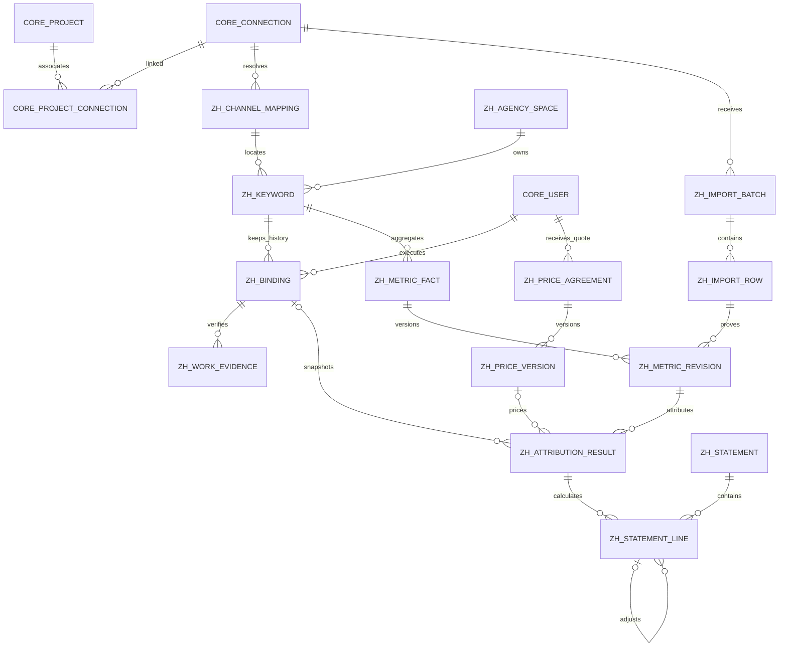

# OPC 聚合平台与知乎归因引擎开发设计

版本：v1.1 · 2026-09-10 · 状态：已基于 0022c82 实施本地开发版，生产真实样本验收待完成。

> 实施依据以用户确认的 S0—S6 计划及 [OPC归因实施记录.md](./OPC归因实施记录.md) 为准。本文原有现状评估、E0—E5 顺序和逻辑表字段保留为设计历史，不能作为当前建表脚本或骨架完成度结论。实际物理结构见 server/schema/zhihu/018—024，当前接口见 server/src/modules/zhihu/routes/attribution.ts。

实施修订：OPC 核心复用已合并的模块化基线；由项目负责人单人推进。公共账号为 integration_accounts，以 accountId 传输，项目关联复用 project_integrations。报价绑定 tasks.id，同任务全部关键词共用；只按有效订单计费。优先期固定 24 小时，首次作品通过后允许对账，来源视为最终并支持修订。新引擎默认须先登记试算边界，显式启用后才能确认应付。

适用对象：产品负责人、公共核心负责人、知乎模块开发者、前后端开发者与测试人员。

## 0. 阅读说明与结论

**OPC 是运营主体管理多个业务平台、项目、团长及达人的聚合平台。知乎是提供业务资源与业绩数据的一个可选模块。新归因引擎位于知乎模块内部，通过关键词独占绑定确定业绩归属，通过两级单价计算应付与毛差价。**

本设计衔接已合并的 OPC 公共核心与业务模块分离成果；归因实现留在知乎模块。本次新增模块资源、事实、报价、核验、对账和恢复链路，不改写历史收益或开放公共资金写入。

### 0.1 依据与优先级

1. 本次对话中用户明确确认的业务规则。
2. 用户提供的公共核心拆分计划，作为本设计的架构接口边界。
3. 当前工作区代码与迁移文件，作为现状证据。
4. 历史方案，仅作为参考；其中的执行命令、签字要求、预算与工期不构成本次授权或已确认事实。

用户指定的 `D:\zhihu\改造` 在本环境不存在。实际参考目录为 `D:\ITEM\zhihu-app\docs\改造`，没有证据证明两者内容完全一致。另参考仓库 `docs/重构文档` 的既有契约和金额边界说明。

代码快照：工作区 `D:\ITEM\zhihu-app`；检查时 HEAD 为 `cf91f2a`（`docs: 添加部署指南`）。检查开始时已有未跟踪的 `docs/改造.zip` 与 `docs/改造/`。同事可能在其他工作区实施，本文不以本地未发现实现推断其工作进度。

### 0.2 评估摘要

| 问题 | 判断 | 对开发的影响 |
|---|---|---|
| 当前项目是否偏离 OPC 定位 | 存在明显的业务耦合：公共启动、配置、项目、导航与财务认识知乎 | 先完成模块装配与独立核心，再接入新归因链路 |
| 已有代码是否需要推倒 | 不需要，身份、团队、成员权限、三端壳层、事务、审计、HTTP 客户端都有复用基础 | 渐进隔离，避免另建一套用户和团队 |
| 纯 OPC 核心是否已经完成 | 当前快照尚不满足；没有独立启动和第二模块接入验收证据 | 不能以页面数量或目录搬迁计为完成 |
| 同事的 M0—M4 计划是否可行 | 可行，契约、静态注册、增量迁移和历史财务隔离方向正确 | 必须同步新库初始化、旧路由封锁和成员范围检查 |
| 旧归因方案是否可直接执行 | 不可直接执行：质量加权、比例抽成、自动调用旧审批与最新需求不一致 | 替换算法和结算语义，保留导入预览、留痕、异常处理思路 |
| 新引擎能保证什么 | 在独占规则被执行、来源映射无歧义的条件下，确定内部结算归属 | 不能把内部绑定宣称为知乎提供的逐订单或逐作品证据 |

### 0.3 开发阅读路径与文档工作项

- 产品与经营：第 1—3 章。
- 架构与公共核心对接：第 4、10、12 章。
- 后端与数据库：第 5—9 章。
- 前端与测试：第 10—13 章。
- 现状评估及复用证据：第 11、14 章。

本次文档工作项：

- [x] 核对业务规则、原方案与当前代码。
- [x] 定义 OPC 职能、模块边界和核心依赖。
- [x] 设计关键词、定价、数据导入、归因与结算链路。
- [x] 给出数据库、接口、关系图和状态流程图。
- [x] 建立代码复用清单、迁移顺序与验收清单。
- [x] 记录实际基线检查及设计限制。

## 1. OPC 的主要职能与经营定位

### 1.1 经营模式

当前主要业务是拓展团长，由团长组织达人扩大执行规模；直属达人是补充。代理对团长及直属达人制定单价，团长对自己的达人制定单价，分别赚取上下级价格之间的毛差价。关键词创建贡献本身不自动生成额外分成。

平台优先帮助运营方减少资源分配、成员管理、业绩核对、对账和争议处理的人力成本。当前不需要演变为通用内容创作平台、开放插件市场或多租户 SaaS。

### 1.2 公共职能与业务职能

| 层次 | OPC 负责 | 知乎模块负责 |
|---|---|---|
| 身份与组织 | 登录、三种角色、组织资料、上下级、项目成员和授权 | 按授权操作模块资源，保存业务发生时的关系快照 |
| 业务项目 | 项目资料、成员、关联模块及接入账号 | 项目内推广计划、知乎任务、关键词与作品 |
| 模块接入 | 目录、静态注册、能力声明、状态、版本兼容 | API/文件等适配器、凭据定义、模块专属健康诊断 |
| 工作台 | 导航、项目选择、标准摘要展示 | 指标定义、口径、数值、来源和数据完整状态 |
| 财务 | 本期只读 Provider 契约与入口；未来公共账本另期建设 | 知乎历史财务适配、新归因与单价试算、模块内对账单 |
| 系统基础 | 审计、日志、任务执行及重试、存储、数据库基础 | 邮件识别、Excel 字段解释、同步时间表、归因任务 |

**公共核心不依赖邮件、关键词、知乎渠道名称或知乎审核状态。** 其他平台可以直接通过 API 提供结果，无需经过知乎数据处理器。

### 1.3 经营指标

OPC 通用层展示活跃项目、活跃团长、团队人数、模块可用状态等公共指标。知乎模块提供关键词可用数、领取后使用率、搜索量、订单量、来源收益、下级应付、代理毛差价、异常金额与待核验时长。

“来源收益”“应付”“毛差价”“已收款”“已付款”必须分别命名。邮件反馈收益不等于平台已实际付款；毛差价尚未扣税费、运营费用与退款。跨模块只能合并定义、币种、单位、统计周期和确认状态一致的指标。

## 2. 业务规则与待定参数

### 2.1 用户已确认

| 编号 | 规则 |
|---|---|
| B01 | OPC 是聚合平台，知乎作为可选业务模块 |
| B02 | 代理有权给团长和直属达人分别制定单价 |
| B03 | 团长有权给自己的达人制定单价 |
| B04 | 主要赚取规模化业务的单价差，团长拓展优先 |
| B05 | 不同代理的关键词隔离，代理内部采用单关键词隔离绑定来解决归因 |
| B06 | 代理创建成功的关键词向团长提供优先搜索、使用能力 |
| B07 | 知乎邮件有效字段只有日期、渠道名称、关键词、搜索量、订单、收益等汇总数据 |
| B08 | 作品在关键词分流归因之后用于核实佐证，不作为质量加权分钱依据 |
| B09 | 公共核心拆分由同事执行；本期核心财务只提供只读边界，不统一旧算法、不重算历史账 |

### 2.2 本设计建议的默认规则

以下为实现建议，不冒充用户已确认的经营政策。配置必须显式持久化，不在代码中隐含默认金额。

| 编号 | 建议 | 原因 |
|---|---|---|
| D01 | 一个关键词只能形成一条有效结算路径，最终落实到一个执行者 | 团队内多人共用同样无法归因到个人 |
| D02 | 搜索只查询；领取事务成功才占用。领取后先保留给团长，分配后允许执行 | 避免把浏览行为当成归属变更 |
| D03 | 用 `leader_priority_until` 表达团长优先期，之后未领取词开放给直属达人 | 已确认固定 24 小时，以服务端上游可用时间为起点 |
| D04 | 已对外使用的词不跨结算对象回收复用；未使用的预留可回收 | 旧作品可能持续贡献汇总业绩 |
| D05 | 价格按业务统计日期生效，以 Asia/Shanghai 的自然日为最小粒度 | 邮件没有日内明细，不支持可靠的日内拆价 |
| D06 | 缺少适用价格则暂停试算，不按零价或全额透传兜底 | 防止无意产生应付款 |
| D07 | 缺作品时保留归因候选，标记待核验；不得把来源收益抹为零 | 核验状态与归因状态应独立 |
| D08 | 首期团长达人价不得高于同口径团长进价，不开放倒挂例外 | 避免把配置错误当成经营补贴 |
| D09 | 团长本人执行时使用 `leader_self` 路径，不强迫另建达人账号 | 仍只计算代理到团长的一层应付 |

### 2.3 需要在上线前落定的业务参数

| 参数 | 当前设计处理 | 落定时点 |
|---|---|---|
| 单价计费单位 | 已确认有效订单，报价绑定推广任务 | 已锁定 |
| 邮件订单及收益 | 按最终有效数据处理；不同值进入修订候选 | 已锁定；真实表头待上线前复核 |
| 优先期与回收 | 24 小时；无默认数量上限；管理员核实后释放未用词 | 已锁定 |
| 报价接受流程 | 发布后按生效日执行，不要求收款方接受 | 已锁定 |
| 代理给团长付款，还是平台代团长向达人付款 | 本设计按逐级应付生成对账单；实际打款方式未确认 | 资金写链路开发前 |
| 上游负向修正、退款、已付超额如何追偿 | 原账不覆盖，生成差额调整；追回或抵扣政策另定 | 负向调整确认前 |
| 历史共用词的处理 | 隔离异常池，逐词明确历史边界；不自动均分 | 历史迁移上线前 |
| 达人自己创建词、团队词进入公共库的详细审核权 | 不是已确认的首期必需流程；保留来源字段，不默认开放跨团队共享 | 对应功能开发前 |

## 3. 归属、定价与金额模型

### 3.1 三种路径



路径枚举：`team_creator`、`direct_creator`、`leader_self`。用户全局角色仍只有 admin、leader、creator，路径不是第四种身份。

团长预留词但尚未分配时，不凭团长存在就自动确定达人收益。若已有来源数据，归属完整性标记为 `reserved_without_executor`，进入核验。

### 3.2 金额公式

设：`Q` 为该统计日已确认的计费数量，`R` 为邮件来源收益，`P_AL` 为代理给团长的单价，`P_LC` 为团长给团队达人的单价，`P_AC` 为代理给直属达人的单价。

| 路径 | 计算 |
|---|---|
| 团队达人 | 代理应付团长 `L = Q × P_AL`；团长应付达人 `C = Q × P_LC`；团长毛差价 `L - C`；代理毛差价 `R - L` |
| 直属达人 | 代理应付达人 `C = Q × P_AC`；代理毛差价 `R - C` |
| 团长本人 | 代理应付团长 `L = Q × P_AL`；代理毛差价 `R - L`；不再构造一笔达人应付 |

例：`Q = 100`、`R = 2000.0000` 元、`P_AL = 15.0000`、`P_LC = 13.0000`：代理应付团长 1500 元，团长应付达人 1300 元，代理毛差价 500 元，团长毛差价 200 元。

**代理的成本是 1500 元，不能再加 1300 元算成 2800 元。** 两层应付属于不同付款主体。同理，团长的可自留收益是 200 元，不能把 1500 元和 200 元一起作为团长可提现收入。

平台代付是未来可能的资金模式：若选代付，需明确授权与账本过桥规则，使代理实际向达人付 1300 元、向团长付 200 元，总流出仍为 1500 元。本期不实现这一模式。

### 3.3 定价命中

定价范围固定到：`projectId + accountId + tasks.id + 付款主体 + 收款人 + 生效日期区间`。首期固定 CNY、有效订单计费。同任务多个关键词使用同一报价，不通过任务同名匹配。

v1 使用明确的收款人报价，不使用多级隐含优先级。批量定价是批量生成个人报价版本；“默认报价模板”只帮助填表，不能在历史结算时动态代替缺失报价。

同范围生效区间使用左闭右开 `[effective_from, effective_to)`，不得重叠。归因试算记录具体价格版本 ID 和金额快照。修改未来价格不得更新旧报价金额，旧账仍引用旧版本。

上游单价仅用于核对，实际代理毛差价以 `R - 下级应付` 计算。若上下级使用不同计费指标，不直接比较单价；v1 不允许同一条路径混用搜索量与订单计价，复杂合同另期扩展。

### 3.4 金额、精度与修正

- 新模块金额存储为 `DECIMAL(20,4)` 元，价格也是元；币种必填，v1 为 CNY。
- 通过 API 传输十进制字符串，数量通过十进制整数字符串传输；禁止 JS `number` 参与金额计算。
- 内部可复用 BigInt 缩放思路：1 元 = 10000 个计算单位。新工具必须支持负数，旧 `toMicro/fromMicro` 不能直接处理负向冲正。
- 当前 DB 池启用 `decimalNumbers: true`；新模块查询金额需 `CAST(... AS CHAR)` 或使用经过核心团队确认的精确字符串适配，不全局改变旧池行为。
- 本期对账单保留 4 位小数。未来打款转换为分时明确舍入规则，并单列舍入差；不得每次查询临时截断。
- 日报修正使用“新应付减旧应付”的差额，引用原账单。已确认记录不 UPDATE 覆盖，也不 DELETE 重建。

## 4. 架构与公共核心对接

### 4.1 目标架构



采用现有 Node.js + TypeScript + Express、MySQL、Bull/Redis、Vue 三端与共享包。先做模块化单体，不引入微服务、分布式事务或通用规则脚本引擎。

### 4.2 建议目录，最终名称服从骨架团队的契约

```text
server/src/
  core/                         # 同事负责：身份、项目、模块服务与公共 Provider
  infrastructure/               # 同事负责：事务、任务执行、存储、日志
  bootstrap/                    # 同事负责：模块选择和装配
  modules/zhihu/
    manifest.ts
    contracts/
    adapters/report/            # 报表解析、表头映射、来源确认
    keywords/                   # 词库、优先领取、占用与历史绑定
    pricing/                    # 两级报价与版本
    attribution/                # 规则归因与异常
    statements/                 # 模块应付试算与对账确认
    evidence/                   # 作品关联与核验
    jobs/
    legacy/                     # 原财务、回调、旧地址兼容
    migrations/                 # 按核心约定注册，编号待合并时分配
apps/platform-*/src/modules/zhihu/
    routes.ts / views/ / api.ts
```

这只是目标结构，不要求在同事完成的目录上再进行一次重命名。公共核心只能经契约调用 Provider，不能导入 `modules/zhihu` 或直接查询 `zh_*` 表。

### 4.3 向核心索取的能力

| 能力 | 最小行为 | 缺失时处理 |
|---|---|---|
| `ProjectAccess` | 校验有效项目成员、角色权限与项目状态 | 拒绝访问，不能仅靠团长身份 |
| `ConnectionAccess` | 校验账号属于模块、项目有关联、账号可用 | 不解析、不执行生产任务 |
| `OrganizationReader` | 获取当前角色、上下级与账号状态 | 不创建绑定或报价 |
| `AuditWriter` | 支持与模块写操作同事务记录操作者、资源和变更原因 | 事务失败时不得返回成功 |
| `JobRuntime` | 按模块及账号注册任务、重试、查询失败状态 | 新导入可保留待处理，不假装完成 |
| `FileStore` | 文件摘要、受权读取、保存与删除策略 | 不把存储路径当作可公开下载 URL |
| Provider 注册 | 标准摘要、只读财务能力、禁用状态 | 公共页面展示不可用或未接入 |

公共身份服务只回答当前关系；知乎绑定和报价保存业务快照，不能要求核心理解关键词归属历史。

### 4.4 财务边界

模块运营数据、模块对账记录、公共资金账本是三个不同层次：

1. `ModuleDataProvider` 只读返回运营指标，不触发账单确认或资金写入。
2. 新知乎引擎计算模块内对账单；“已确认”表示业务账单被确认，不表示已入公共余额或已付款。
3. 骨架本期 `FinanceProvider` 仍是只读接口；新对账单通过模块入口查看，不能借 Provider 增加公共写操作。
4. 旧 `earnings`、结算与提现保留在知乎历史兼容入口，新引擎不直接写入旧表。
5. 以后建设公共资金链时，再定义 `SettlementExport/PostingPort`、分录唯一键、确认回执及冲正协议。本文不将它们伪装成已存在接口。

### 4.5 模块开关

建议知乎模块内部另设 `attribution_v2` 和按范围的 `legacy/v2` 来源路由。模块被禁用时，不注册新旧路由、不加载知乎凭据、不启动任务；已入队任务执行前再次检查启用状态。禁用不删除模块数据。

切换 v2 后，不能把同一来源同时送入 `settleEarnings` 和新对账链路。回退只关闭新的写入和任务，保留只读查看及已确认快照，不重新把 v2 日期交回旧链路自动结算。

## 5. 完整业务链路与状态

### 5.1 关键词供应与使用



`available` 必须建立在真实上游创建成功之上，不能以本地 INSERT 成功或任务入队成功判断。`leader_priority_until` 决定谁能领取，与状态分别保存。

`retired` 只禁止新增使用，历史路径保留以接收尾部数据。未登记作品不等于从未对外使用；回收需结合使用声明、已生成发布资源、导入指标和人工确认。没有证据时保留冻结，不承诺等待固定天数就能安全复用。

### 5.2 领取与分配事务



两个请求同时领取只能一个成功。不能用“先查 available，再在另一个事务 INSERT”的方式保证独占。团长批量分配时按关键词 ID 升序锁定，避免相互反向锁定；批量接口逐项返回成功与失败，不以一个成功掩盖其他失败。

### 5.3 数据到对账



### 5.4 状态分离

| 对象 | 状态 | 说明 |
|---|---|---|
| 导入批次 | uploaded / parsed / preview_ready / committed / rejected / failed | 文件提交不是业务导入完成 |
| 指标事实完整性 | partial / complete / disputed | 搜索和订单邮件分批到达，不把缺失当成 0 |
| 数据确认级别 | provisional / final | 平台预估数据不自动变成最终应付 |
| 归因 | matched / unmatched / ambiguous / legacy_shared | matched 只表示内部路径确定 |
| 核验 | pending / passed / flagged / waived | waived 要记录原因和批准者 |
| 计价 | ready / missing_price / conflicting_price / blocked | 缺价不阻塞搜索量的只读展示 |
| 对账单 | draft / confirmed / cancelled | cancelled 仅适用于草稿；确认后用调整单 |

作品数量、浏览量、点赞量不能改变归因分配权重。抽查不通过时冻结相关对账项并记录原因，不自动把收益转给另一人。

## 6. 数据导入与确定性归因规则

### 6.1 来源范围与自然键

邮件只有渠道名称，没有可靠的内部账号 ID、项目 ID 和用户 ID。上传时必须选择经过授权的接入账号；项目或计划可由已验证映射确定，不能根据同名渠道猜测。

接入账号内的 `渠道别名 + 业务日期` 解析到唯一渠道映射；再以 `渠道 + 关键词` 解析到唯一资源及推广计划。若相同渠道、关键词对应多个项目或计划，邮件没有足够维度区分，进入歧义池，不能挑第一个项目。

规范化指标事实自然键：

```text
接入账号 ID + 渠道映射 ID + 关键词 ID + 业务日期
```

项目与计划从映射带出。不要把手工任意选择的项目加到自然键后，就允许同一上游事实重复计入不同项目。

代理内部关键词业务唯一键：`agency_space_id + keyword_canonical`。v1 的同一运营代理共享一个词空间，即使接入账号不同也不放宽业务独占。数据查询仍必须带接入账号与项目范围，不能依赖词唯一就省略授权。

### 6.2 原始值和规范值

- 永久保留原始日期、渠道名称、关键词、搜索量、订单、收益和行号，以原文件摘要定位来源。
- 规范化规则带版本号。默认只去除已确认可忽略的边界空白；不擅自删除内部空格、标点、转大小写或进行全半角合并。
- MySQL 关键词唯一索引采用二进制语义的排序规则，避免数据库不区分大小写造成额外合并。
- 日期字段进行真实日历校验，不能只靠正则。Excel 日期序列、字符串日期和业务时区由报告模板分别解析。
- 数量为非负整数；普通日报负值进入异常。负向“调整报告”必须有独立类型与来源，不能混入普通日报增量。
- 单位由模板明确；百分比列不当作订单，人民币金额不能再次乘 100。

### 6.3 搜索与订单邮件合并

报告模板声明每种来源拥有的指标。例如搜索报告拥有搜索量，订单报告拥有订单数和收益。订单报告也含搜索量时，作为交叉核对值，不能和搜索报告相加。

若实际只有一份综合报表，则以综合模板拥有三个指标。不能硬编码一定有两封邮件。旧回执中提到的具体发送时间、字段和“昨日新增”是参考线索，必须以接入模板及真实样本验证。

相同自然键的合并规则：

1. 相同源类型、相同内容摘要：去重，不新增有效业绩。
2. 相同源类型、同一日期但值不同：建立修订候选，待确认替代关系，不盲目累加或最后写入覆盖。
3. 不同源类型：按指标所有权合并；冲突标记 disputed。
4. 缺列或缺报：对应值保持 NULL。只有来源明确给出的 0 才存为 0。
5. 同文件内重复自然键：完全相同行也保留原始行并去重；不同值进入冲突，不任意求和。

文件摘要去重和事实自然键去重必须同时存在：改文件名、重发邮件或更换导出格式都不能再次结算。

### 6.4 判定顺序

```text
1. 校验模块、接入账号和项目状态；装载事实版本。
2. 解析渠道和关键词；零命中为 unmatched，多命中为 ambiguous。
3. 查覆盖业务日期的绑定版本；历史共用词进入 legacy_shared。
4. 验证绑定路径完整，归属与统计期吻合；保存历史快照。
5. 作品仅改变 verification_status，不改变 matched 的业绩数量。
6. 按日期与付款关系查唯一报价版本；缺价或重叠报价暂停计价。
7. 校验计费指标到齐且具备所需确认级别，计算两级应付与毛差价。
8. 原子保存归因版本、快照及草稿明细；同输入重试返回同结果。
9. 确认对账前检查事实版本仍为当前有效版本，防止确认过期草稿。
```

不设置没有证据支持的“90% 置信度”。使用可解释原因码：`CHANNEL_UNMAPPED`、`KEYWORD_UNKNOWN`、`BINDING_MISSING`、`BINDING_CONFLICT`、`LEGACY_SHARED`、`PERIOD_AMBIGUOUS`、`REPORT_INCOMPLETE`、`PRICE_MISSING`、`PRICE_OVERLAP`、`EVIDENCE_PENDING`、`SOURCE_REVISION_PENDING`。

### 6.5 时间、转团队与历史

绑定同时保存实际操作时间和业务生效日期。新词必须先绑定后发布；首日出现早于词创建、绑定的历史数据时，进入核验。一天内发生不同结算路径的使用，不按小时比例分配日报。

达人转团队、团长账号停用或成员退出不回写历史绑定和对账快照。v1 已使用关键词继续保留原商业归属，停止新增使用或走人工终止；新团队使用新关键词。商业归属与当前访问权限分开：离队者不得因为历史绑定而访问旧项目全部数据。需查看自己的历史对账时，通过明确的个人账单授权入口提供最小范围，而不是绕过项目权限。

### 6.6 重试与一致性

导入确认事务写原始行和待处理状态，提交后才投递队列。若提交成功但投递失败，由模块周期扫描 `committed + 未处理` 批次补投；数据库状态是事实来源，不依赖内存队列作为唯一持久记录。

任务键至少带 `moduleId + accountId + batchId/revisionId + algorithmVersion`。任务失败可重试，同一事实版本与相同绑定、价格、核验版本只生成一份结果。处理大量行采用小批事务，每组自然键先排序锁定。归因运算不在持锁期间调用外部平台。

对账确认与来源修订都锁定同一事实主记录：确认先发生则后续修订生成调整；修订先发生则旧草稿不能确认。数据库提交失败不发布成功消息。

## 7. 数据库设计

### 7.1 公共表复用及建模约定

复用现有 `users`、`roles`、`project_members`、`projects`、`mcn_accounts`、`audit_logs` 的身份、项目和组织意义。模块安装、接入账号及项目关联表由骨架团队建立，本文用逻辑名 `integration_accounts`、`project_integrations` 指代，**不要求他们采用该物理表名，也不在本方案重复建表**。

`mcn_accounts` 继续表示运营组织资料，不能直接当作平台凭据账号。`users.parent_id` 可以验证领取时上下级，但不能作为历史结算时唯一关系依据。

新模块表以 `zh_` 为前缀，与旧 `plans/daily_metrics/earnings` 分离。现有推广计划在隔离后的知乎模块内复用，用 `legacy_plan_id` 关联过渡。若骨架迁移重命名表，使用其最终的模块资源标识，避免双建推广计划。

字段约定：

| 类型 | 约定 |
|---|---|
| `id` / 外键 | BIGINT，沿用当前库有符号类型；API 返回字符串 |
| `created_at/updated_at` | DATETIME(3)，新模块写 UTC，展示按业务时区；不要隐式更改旧库时区 |
| `business_date/effective_from` | DATE，业务时区 Asia/Shanghai |
| 金额 | DECIMAL(20,4)，元；读取及传输为字符串 |
| 数量 | BIGINT 非负，API 为整数字符串 |
| 摘要 | BINARY(32)，SHA-256；参与摘要的规范串必须有版本与稳定字段顺序 |
| 状态 | VARCHAR(32) + 校验约束/应用 Schema，不扩展旧全局枚举 |
| JSON | 原始载荷、快照或扩展元数据；查询和唯一约束所需字段必须独立列 |

所有新增表都有 `id`、`created_at`；可变主表另有 `updated_at` 和乐观锁 `version INT`。快照表不可变，修正以新版本实现。业务 FK 默认 RESTRICT，不级联删除财务证据。公共实体删除通过核心软停用处理。

### 7.2 表清单

| 域 | 新表 | 用途 |
|---|---|---|
| 资源 | `zh_agency_spaces` | 代理关键词空间与领取政策，v1 一个运营代理初始化一条 |
| 资源 | `zh_channel_mappings` | 接入账号内渠道别名及项目映射 |
| 资源 | `zh_keywords` | 代理统一词库、上游状态与当前绑定 |
| 资源 | `zh_keyword_bindings` | 团长预留、执行人、使用日期及归属快照 |
| 定价 | `zh_price_agreements` | 一条明确付款关系与计费口径，作为版本并发锁对象 |
| 定价 | `zh_price_versions` | 按日期生效的报价版本 |
| 来源 | `zh_import_batches` | 原文件、模板、来源、导入状态与统计 |
| 来源 | `zh_import_rows` | 原始行、解析结果、错误与去重状态 |
| 来源 | `zh_metric_facts` | 指标自然键与当前确认的事实版本指针 |
| 来源 | `zh_metric_revisions` | 合并后的搜索、订单、来源收益和逐指标出处 |
| 归因 | `zh_attribution_results` | 归属、关系快照、计价输入与解释 |
| 核验 | `zh_work_evidence` | 作品绑定与核验版本；引用已有作品表 |
| 异常 | `zh_exceptions` | 未归因、争议、修订、缺价等处置记录 |
| 对账 | `zh_statements` | 按付款人、收款人及账期组织的模块对账单 |
| 对账 | `zh_statement_lines` | 逐归因结果的应付明细和差额调整 |
| 请求 | `zh_idempotency_requests` | 领取、导入确认、报价发布、对账确认的重试收据 |

无需把每张表做成独立服务。上述 16 张表分属 5 个模块内业务区域，仍在同一进程和同一事务边界内。

### 7.3 资源表

**`zh_agency_spaces`**

| 字段 | 类型/空值 | 含义与约束 |
|---|---|---|
| `space_key` | VARCHAR(64)，非空唯一 | 稳定代理空间标识，与 admin 登录用户 ID 分开 |
| `name` | VARCHAR(128)，非空 | 运营代理名称 |
| `mcn_account_id` | BIGINT，可空 | 关联组织资料，不保存外部平台凭据 |
| `leader_priority_seconds` | INT，可空 | 未配置表示词库开放政策未就绪 |
| `reservation_limit` | INT，可空 | 单团长未使用预留额度 |
| `reservation_ttl_seconds` | INT，可空 | 未使用预留到期检查时间，不代表已用词可复用 |
| `status` | VARCHAR(32) | active / suspended |

v1 不新增多运营主体注册、计费或租户切换能力。空间的意义是统一词唯一性与政策，不把每个管理员账号当成一家代理。

**`zh_channel_mappings`**

| 字段 | 类型/空值 | 含义与约束 |
|---|---|---|
| `agency_space_id, account_id, project_id` | BIGINT，非空 | 空间、公共接入账号和项目 |
| `external_channel_id` | VARCHAR(128)，可空 | 有官方渠道 ID 时保存 |
| `canonical_mapping_id` | BIGINT，可空 | 主记录为空；别名版本指向稳定主记录，禁止多级别名链 |
| `channel_name_raw, channel_name_canonical` | VARCHAR(255)，非空 | 原始名称及确认后的匹配名称 |
| `normalization_version` | VARCHAR(32)，非空 | 标准化版本 |
| `effective_from, effective_to` | DATE，后者可空 | 渠道名称映射生效区间 |
| `status` | VARCHAR(32) | active / retired |
| `created_by` | BIGINT，非空 | 核对映射的管理员 |

索引 `(account_id, channel_name_canonical, effective_from)`。同一账号内同名渠道的日期区间不重叠；发布映射时锁公共账号对应的模块配置行或固定范围锁。渠道更名建立新映射并关联同一外部渠道，不篡改旧来源原名。事实使用 `COALESCE(canonical_mapping_id, id)` 作为稳定渠道映射 ID，别名必须属于同一账号与项目。

**`zh_keywords`**

| 字段 | 类型/空值 | 含义与约束 |
|---|---|---|
| `agency_space_id` | BIGINT，非空 | 全代理词唯一性边界 |
| `account_id, project_id, channel_mapping_id` | BIGINT，非空 | 原始来源及授权范围 |
| `legacy_plan_id` | BIGINT，可空 | 现有知乎推广计划；不是业务项目 |
| `keyword_raw, keyword_canonical` | VARCHAR(128)，非空 | 与当前计划词长一致；超长拒绝，不截断 |
| `normalization_version` | VARCHAR(32)，非空 | 正规化规则版本 |
| `upstream_status, lifecycle_status` | VARCHAR(32)，非空 | 上游成功与内部可领取状态分开 |
| `created_by, source_kind` | BIGINT / VARCHAR(32)，非空 | 创建者和 admin_created / legacy 等来源，不等于收益所有者 |
| `upstream_confirmed_at, leader_priority_until` | DATETIME(3)，可空 | 成功时间和优先期终点 |
| `current_binding_id` | BIGINT，可空 | 当前占用指针，事务维护 |
| `used_ever_at` | DATETIME(3)，可空 | 曾对外使用后不清空 |
| `legacy_mode` | VARCHAR(32)，非空 | new / verified_exclusive / shared_unresolved |

唯一键 `(agency_space_id, keyword_canonical)`；索引 `(project_id, account_id, lifecycle_status, leader_priority_until, id)`、`(channel_mapping_id, keyword_canonical)`。旧词若同名但来源冲突，不强行合并，放入迁移异常清单。

**`zh_keyword_bindings`**

| 字段 | 类型/空值 | 含义与约束 |
|---|---|---|
| `keyword_id` | BIGINT，非空 | 对应词资源 |
| `binding_no` | INT，非空 | 词内版本号 |
| `path_type` | VARCHAR(32)，非空 | reserved / team_creator / direct_creator / leader_self |
| `leader_id, executor_id` | BIGINT，可空 | 团长、最终执行者；预留可没有执行者 |
| `project_id, account_id, agency_space_id` | BIGINT，非空 | 归属快照，必须与关键词一致 |
| `relation_snapshot` | JSON，非空 | 领取/分配时的角色、上下级、项目成员证明与核心版本 |
| `claimed_at, assigned_at, use_started_at` | DATETIME(3)，后两项可空 | 实际发生时间 |
| `activated_on` | DATE，可空 | 确认先绑定后使用的业务起始日 |
| `released_at` | DATETIME(3)，可空 | 仅未使用预留或分配允许释放 |
| `stop_new_use_at` | DATETIME(3)，可空 | 停止新增使用，不取消尾部收益归属 |
| `created_by, release_reason` | BIGINT / VARCHAR(500)，原因可空 | 操作者与撤回依据 |

唯一键 `(keyword_id, binding_no)`。未释放绑定使用生成列建立唯一键，详见 7.9。激活后归属字段不可编辑，团长换达人必须用新词。预留阶段分配执行人允许更新，但必须写审计；若已激活则拒绝。

业务 CHECK：team_creator 必须有团长和不同的达人；direct_creator 团长为空；leader_self 执行者等于团长；reserved 执行者为空且 activated_on 为空。角色及上下级有效性通过核心服务校验，不能仅靠 CHECK。

### 7.4 定价表

**`zh_price_agreements`**

| 字段 | 类型/空值 | 含义与约束 |
|---|---|---|
| `agency_space_id, project_id, account_id, keyword_plan_id` | BIGINT，非空 | 计划和账号范围；计划 ID 指向隔离后的知乎计划 |
| `payer_kind, payer_id` | VARCHAR(16) / BIGINT，非空 | agency_space 或 user；不以操作者充当付款主体 |
| `payee_user_id` | BIGINT，非空 | 具体团长或达人 |
| `relation_type` | VARCHAR(32)，非空 | agency_leader / agency_creator / leader_creator |
| `billing_metric` | VARCHAR(32)，非空 | order_count / search_count，配置时显示是否已核实有效口径 |
| `currency` | CHAR(3)，非空 | CNY |

以上范围字段组成唯一键。需要控制索引长度时用稳定 `scope_hash BINARY(32)` 唯一，并在发生哈希冲突时比较原字段后报错，不能把不同范围当同一协议。

**`zh_price_versions`**

| 字段 | 类型/空值 | 含义与约束 |
|---|---|---|
| `agreement_id, version_no` | BIGINT / INT，非空 | 唯一 `(agreement_id, version_no)` |
| `unit_price` | DECIMAL(20,4)，非空 | CHECK >= 0 |
| `effective_from, effective_to` | DATE，后者可空 | 左闭右开，不重叠 |
| `status` | VARCHAR(32)，非空 | draft / published / withdrawn |
| `created_by, published_by, published_at` | BIGINT / BIGINT / DATETIME(3) | 发布者与授权记录 |
| `reason, relationship_snapshot` | VARCHAR(500) / JSON | 调价原因及当时上下级 |

发布时锁 `zh_price_agreements` 行，检查区间冲突后写入。修改旧版本的区间终点仅允许明确的未来变更且写审计；已经用于账单的价格值不能改变。回补历史报价必须走人工修订，不能默认以今天的报价覆盖过去日期。

代理下调团长进价时，发布前检查已发布的团队达人价；若出现未来日期下级价高于进价，默认拒绝并列明受影响报价。团长也不能发布超出自己可核实进价有效区间的报价。补贴政策若开启，要另存例外批准记录。

### 7.5 导入与事实表

**`zh_import_batches`**

| 字段 | 类型/空值 | 含义与约束 |
|---|---|---|
| `agency_space_id, account_id` | BIGINT，非空 | 来源账号由授权上下文确认 |
| `report_kind, template_version, parser_version` | VARCHAR(32)，非空 | search / order / combined / adjustment 等 |
| `original_filename, storage_ref` | VARCHAR(255)，非空 | 原文件展示名称、公共文件存储标识 |
| `file_sha256` | BINARY(32)，非空 | 文件级去重 |
| `message_id` | VARCHAR(255)，可空 | 未来邮件追踪，不作为唯一业务去重依据 |
| `source_period_start, source_period_end` | DATE，可空 | 从报告确认的统计区间 |
| `status, source_finality` | VARCHAR(32)，非空 | 导入状态、预估或最终 |
| `total_rows, valid_rows, error_rows, duplicate_rows` | INT，非空 | 精确行数，不只统计成功行 |
| `uploaded_by, committed_by, committed_at` | BIGINT / BIGINT / DATETIME(3) | 操作证据 |
| `supersedes_batch_id` | BIGINT，可空 | 显式来源替代，不能仅按上传顺序覆盖 |
| `processing_status, last_error, retry_count` | VARCHAR(32) / TEXT / INT | 任务补偿与失败可见性 |

唯一 `(account_id, report_kind, file_sha256)`。同文件换解析器不重复创建来源批次，重新解析产生新解析版本，已确认行保持原值。

**`zh_import_rows`**

字段：`batch_id BIGINT`、`sheet_name VARCHAR(128)`、`row_no INT`、`parse_version INT`、`raw_cells JSON`、`normalized_payload JSON`、`content_hash BINARY(32)`、`business_date DATE NULL`、`channel_name_raw VARCHAR(255)`、`keyword_raw VARCHAR(128)`、`search_count/order_count BIGINT NULL`、`revenue_yuan DECIMAL(20,4) NULL`、`row_status VARCHAR(32)`、`error_codes JSON`、`duplicate_of_row_id BIGINT NULL`。

唯一 `(batch_id, sheet_name, row_no, parse_version)`；索引 `(batch_id, row_status, id)`。解析失败也保存行号和可安全展示的错误。允许部分导入时，用户明确确认有效行集合；批次标记 partial，不能假称整个报告完整。导入预览不得调用结算写接口。

**`zh_metric_facts`**

字段：`account_id`、`project_id`、`agency_space_id`、`channel_mapping_id`、`keyword_id`、`keyword_plan_id` 均 BIGINT 非空；`business_date DATE`；`current_revision_id BIGINT NULL`；`processing_status VARCHAR(32)`；`source_route VARCHAR(16)` 为 legacy / v2；`version INT`。

唯一 `(account_id, channel_mapping_id, keyword_id, business_date)`；索引 `(project_id, business_date, id)`、`(processing_status, id)`。自然键中的渠道映射必须能处理更名的稳定渠道身份：同一渠道更名映射应归一到稳定主映射 ID，别名版本保存在 revision 中，避免更名造成重复事实。

**`zh_metric_revisions`**

| 字段 | 类型/空值 | 含义与约束 |
|---|---|---|
| `fact_id, revision_no` | BIGINT / INT，非空 | 唯一版本 |
| `search_count, order_count` | BIGINT，可空 | 缺失不同于零 |
| `revenue_yuan` | DECIMAL(20,4)，可空 | 来源值，不能根据下级价格反推 |
| `currency` | CHAR(3)，非空 | CNY |
| `search_source_row_id, order_source_row_id, revenue_source_row_id` | BIGINT，可空 | 每个指标指向具体原始行 |
| `completeness, source_finality` | VARCHAR(32)，非空 | partial/complete/disputed；provisional/final |
| `canonical_hash` | BINARY(32)，非空 | 指标、出处与模板版本的稳定摘要 |
| `supersedes_revision_id` | BIGINT，可空 | 上一确认版本 |
| `accepted_by, accepted_at, reason` | BIGINT / DATETIME(3) / VARCHAR(500)，可空 | 修订确认 |

唯一 `(fact_id, revision_no)`、`(fact_id, canonical_hash)`。只有已接受的 revision 能成为 current 指针。初次合法导入可按配置接受；冲突与修订须人工确认。订单计费缺搜索量时可以归属和预估，但是否可确认账单由该模板所需指标决定，而不是一律要求三项齐全。

### 7.6 归因、核验与异常表

**`zh_attribution_results`**

字段：`fact_revision_id`、`binding_id NULL`、`agency_price_version_id NULL`、`leader_price_version_id NULL`、`executor_id NULL`、`leader_id NULL`、`project_id`、`account_id`；`algorithm_version VARCHAR(32)`；`input_hash BINARY(32)`；`attribution_status/verification_status/pricing_status VARCHAR(32)`；`billing_metric VARCHAR(32) NULL`；`billable_quantity BIGINT NULL`；`source_revenue_yuan/agency_payable_yuan/creator_payable_yuan/agency_margin_yuan/leader_margin_yuan DECIMAL(20,4) NULL`；`relation_snapshot JSON`；`pricing_snapshot JSON`；`evidence_snapshot JSON`；`reason_codes JSON`；`supersedes_result_id BIGINT NULL`。

唯一 `(fact_revision_id, algorithm_version, input_hash)`；索引 `(project_id, executor_id, created_at)`、`(project_id, leader_id, created_at)`、`(attribution_status, pricing_status, id)`。`input_hash` 包括归属、价格、核验状态版本，不只包含算法版本。

无归因时仍记录来源金额，执行人和应付保持 NULL。已确认账单引用的结果不可变；新结果不自动使旧账单失效，需要差额调整。

**`zh_work_evidence`**

字段：`keyword_id`、`binding_id`、`executor_id`、`project_id`、`account_id`；`composition_id BIGINT NULL` 引用现有模块作品；`external_platform VARCHAR(32)`、`work_url VARCHAR(2048)`、`work_identity_hash BINARY(32)`、`published_at DATETIME(3)`、`submitted_by BIGINT`、`evidence_version INT`、`verification_status VARCHAR(32)`、`verified_by BIGINT NULL`、`verified_at DATETIME(3) NULL`、`reason VARCHAR(500) NULL`、`attachment_refs JSON NULL`。

唯一 `(binding_id, work_identity_hash, evidence_version)`。同作品重复登记不能重复增加业绩。同作品关联不同执行人时进入冲突；若业务允许一作品多关键词，需要逐个绑定核验，但不重复计入上游事实。URL 仅作为证据，不在归因事务中自动抓取；未来抓取需独立网络访问策略。

**`zh_exceptions`**

字段：`project_id NULL`、`account_id`、`resource_type VARCHAR(32)`、`resource_id BIGINT`、`reason_code VARCHAR(64)`、`state VARCHAR(32)`（open / investigating / resolved / rejected）、`source_revision_id BIGINT NULL`、`affected_amount_yuan DECIMAL(20,4) NULL`、`assigned_to BIGINT NULL`、`resolution_type VARCHAR(32) NULL`、`resolution_payload JSON NULL`、`resolved_by BIGINT NULL`、`resolved_at DATETIME(3) NULL`、`version INT`。

同一资源同一原因只保留一个活动异常，历史通过审计保留。未能映射项目的来源仅管理员可见，不能临时挂到任意项目。修订、申诉或人工分配都引用异常 ID；人工分配是明确的经营处置，标记 `manual_resolution`，不宣称恢复了真实贡献比例。

### 7.7 对账表

**`zh_statements`**

| 字段 | 类型/空值 | 含义 |
|---|---|---|
| `agency_space_id, project_id, account_id` | BIGINT，非空 | 对账范围 |
| `payer_kind, payer_id, payee_user_id` | VARCHAR(16) / BIGINT / BIGINT | agency_space/user 的付款主体与具体收款人 |
| `period_start, period_end` | DATE，非空 | 账期，明确含首尾日期 |
| `currency, statement_no` | CHAR(3) / VARCHAR(64)，非空 | statement_no 唯一 |
| `statement_kind` | VARCHAR(16) | regular / adjustment |
| `status` | VARCHAR(16) | draft / confirmed / cancelled |
| `total_payable_yuan` | DECIMAL(20,4) | 应付合计，调整单允许负值 |
| `content_hash` | BINARY(32) | 确认前完整内容摘要 |
| `created_by, confirmed_by, confirmed_at` | BIGINT / BIGINT / DATETIME(3) | 确认记录 |
| `acknowledged_by, acknowledged_at` | BIGINT / DATETIME(3)，可空 | 收款方确认记录，可后续启用 |
| `origin_statement_id` | BIGINT，可空 | 调整所对应的原单 |

索引 `(project_id, payer_kind, payer_id, period_end)`、`(payee_user_id, status, period_end)`。允许一个账期多张补充或调整单，因此不简单把账期和收款人做唯一键来阻止合法补单，幂等由明细和请求收据负责。

**`zh_statement_lines`**

字段：`statement_id`、`attribution_result_id`、`fact_id`、`business_date`、`obligation_type VARCHAR(32)`（agency_leader / agency_creator / leader_creator）；`quantity BIGINT`、`unit_price_yuan DECIMAL(20,4)`、`amount_yuan DECIMAL(20,4)`；`price_version_id BIGINT`、`calculation_snapshot JSON`；`line_kind VARCHAR(16)`（regular / adjustment）；`origin_line_id BIGINT NULL`、`exception_id BIGINT NULL`、`source_transition_hash BINARY(32)`；`confirmed_at DATETIME(3) NULL`。

普通明细金额为 `quantity × unit_price`。调整明细金额为 `新结果 - 已确认净额`，quantity 和 price 是本次修订的重算输入，**不要求调整金额等于这两个展示值之积**，差额分解写入 calculation_snapshot。

唯一键 `(fact_id, obligation_type, source_transition_hash)`，摘要包含原确认状态、新结果和付款/收款主体。确认时锁 fact，验证该付款关系该事实的普通应付尚未确认，或调整引用的是最新已确认净额，阻止不同草稿重复计账。草稿撤销后可重新挂接未确认明细，但确认的明细不可移动。

确认权限：代理确认 agency_leader/agency_creator；团长只确认自己作为付款人的 leader_creator。团长确认前，相关代理到团长输入应已核对到对应事实版本。来源修订使任一层过期时，两层分别生成调整，不互相覆盖。

### 7.8 幂等请求收据

**`zh_idempotency_requests`**：`account_id`、`actor_id`、`operation VARCHAR(64)`、`idempotency_key VARCHAR(128)`、`request_hash BINARY(32)`、`status VARCHAR(16)`（processing/succeeded/failed）、`result_resource_type VARCHAR(32) NULL`、`result_resource_id BIGINT NULL`、`response_status INT NULL`、`response_payload JSON NULL`、`expires_at DATETIME(3) NULL`。

唯一 `(account_id, actor_id, operation, idempotency_key)`。同键同载荷返回原结果，同键异载荷返回 409。业务写入与成功收据在同事务提交；失败回滚不能留下永久 processing。任务崩溃后的恢复依据事务和资源唯一约束，不能仅靠收据过期就重新付钱。

### 7.9 关键 SQL 约束示意

以下是设计片段，不是已执行的 migration；正式建表需按骨架最终表名、MySQL 版本和 FK 类型生成，并在隔离库验证。MySQL 应使用实际支持并执行 CHECK 的版本（8.0.16+）。

```sql
-- 全代理词唯一；只示意新增约束，不直接应用到历史重复数据。
ALTER TABLE zh_keywords
  MODIFY keyword_canonical VARCHAR(128)
    CHARACTER SET utf8mb4 COLLATE utf8mb4_bin NOT NULL,
  ADD UNIQUE KEY uk_zh_keyword_space (agency_space_id, keyword_canonical);

-- MySQL 不支持 WHERE 条件式唯一索引；NULL 可重复的生成列用于独占。
ALTER TABLE zh_keyword_bindings
  ADD COLUMN occupied_keyword_id BIGINT
    GENERATED ALWAYS AS (
      CASE WHEN released_at IS NULL THEN keyword_id ELSE NULL END
    ) STORED,
  ADD UNIQUE KEY uk_zh_keyword_occupied (occupied_keyword_id),
  ADD UNIQUE KEY uk_zh_binding_version (keyword_id, binding_no);

-- 仍需在关键词行锁中维护 current_binding_id；唯一键是最后防线。
SELECT id, current_binding_id, used_ever_at, version
FROM zh_keywords
WHERE id = ? AND project_id = ? AND account_id = ?
FOR UPDATE;

-- 报价发布先锁稳定的协议主行，防止“两边都没查到冲突”后同时插入。
SELECT id FROM zh_price_agreements WHERE id = ? FOR UPDATE;
SELECT id FROM zh_price_versions
WHERE agreement_id = ? AND status = 'published'
  AND effective_from < COALESCE(?, '9999-12-31')
  AND COALESCE(effective_to, '9999-12-31') > ?;
-- 参数依次为 agreement_id、新 effective_to、新 effective_from。
-- 查到行则拒绝重叠；明确的未来调价先在同事务结束旧区间，再检查插入。

-- 同一上游事实只确认一个当前版本。
ALTER TABLE zh_metric_facts
  ADD UNIQUE KEY uk_zh_fact (
    account_id, channel_mapping_id, keyword_id, business_date
  );

ALTER TABLE zh_metric_revisions
  ADD UNIQUE KEY uk_zh_fact_revision (fact_id, revision_no),
  ADD UNIQUE KEY uk_zh_fact_content (fact_id, canonical_hash);
```

跨表范围一致性要落实：优先通过复合 FK 保证 `(keyword_id, project_id, account_id)` 等同范围引用；骨架不支持的公共 FK 用公共服务加数据库事务复查，并纳入负向测试。前端传来的 agency、payer、leader 不能直接信任。

### 7.10 关系图



图中 CORE_* 是逻辑公共对象，ZH_* 对应本章新表。`ZH_IMPORT_ROW → ZH_METRIC_REVISION` 表示三类指标来源关系的汇总画法，不是只能引用一行。异常与幂等收据为跨对象辅助表，未展开以保持图可读。

## 8. 服务与 API 设计

### 8.1 服务职责

| 服务 | 输入与输出 | 禁止承担的职责 |
|---|---|---|
| KeywordService | 创建状态、搜索、领取、分配、冻结、归属历史 | 不能计算公共余额 |
| PriceService | 发布报价版本、查当日唯一价格、检测价差冲突 | 不能改历史报价金额 |
| ReportService | 文件、模板、来源 → 原始行、预览、事实修订 | 不能根据用户名假造邮件字段 |
| AttributionService | 指标事实、历史绑定 → 可解释归属 | 不按浏览量估算真实订单分布 |
| EvidenceService | 已绑定作品 → 核验版本与争议 | 不直接修改业绩总量 |
| StatementService | 归因、价格快照 → 两层对账与调整 | 不直接写旧 earnings 或启动提现 |
| ZhihuDataProvider | 已授权的只读指标 | 读取不得触发归因、确认或补账 |

### 8.2 路由命名与作用域

以下相对路径均挂在 `/api/v1/modules/zhihu`。请求通过公共认证，服务端先解析 projectId/accountId，再校验业务对象真实范围。响应沿用项目统一 Envelope、分页和 AppError 数字错误码；原因码放在数据字段中，不另建不兼容错误封装。具体数字码由已有契约注册表分配。

| 方法与路径 | 权限/角色 | 关键输入与结果 |
|---|---|---|
| GET `/keywords` | `zhihu.keyword.read` | projectId、accountId、keyword、availability；返回领取资格、状态、本人可见价格 |
| POST `/keywords` | `zhihu.keyword.create`，admin | 上游计划参数；返回 pending_upstream，不提前表示成功 |
| POST `/keywords/:id/claim` | `zhihu.keyword.claim`，leader/直属 creator | Idempotency-Key；返回绑定 ID、状态、版本 |
| POST `/bindings/:id/assign` | `zhihu.keyword.assign`，归属 leader | executorId、expectedVersion；校验本团队且为项目成员 |
| POST `/bindings/:id/activate` | `zhihu.keyword.use`，绑定执行者 | 使用声明、可选作品 ID；记录实际时间和起始业务日 |
| POST `/bindings/:id/release` | `zhihu.keyword.release`，归属管理者 | 原因、未使用核验依据、expectedVersion |
| GET `/keywords/:id/history` | admin/有权的归属管理者 | 受权的版本历史，不泄露其他团队价格 |
| POST `/price-agreements` | admin/leader，按付款关系限制 | 计划、payee、metric；payer 从服务端确定 |
| POST `/price-agreements/:id/versions` | `zhihu.price.manage` | unitPrice、effectiveFrom、effectiveTo、reason |
| POST `/price-versions/:id/publish` | 报价付款方 | 冲突和下级价格检查、写发布审计 |
| GET `/prices/effective` | 报价收付款方 | businessDate；返回确切版本，不能查其他团队报价 |
| POST `/imports` | `zhihu.report.import`，admin | multipart 文件、accountId、reportKind、templateVersion；202 与批次 ID |
| GET `/imports/:id/preview` | admin | 有效/错误/重复行、日期、单位、来源映射及金额摘要 |
| POST `/imports/:id/commit` | admin | previewHash、acceptedRowIds/全部有效行标记、Idempotency-Key |
| POST `/metric-revisions/:id/accept` | `zhihu.report.revise`，admin | reason、expectedCurrentRevisionId；修订同一事实 |
| GET `/attributions` | 按项目和本人/团队范围 | 状态过滤、来源数量、归属结果、本人可见金额 |
| GET `/attributions/:id/trace` | 受限追踪权限 | 来源行 → 映射 → 绑定 → 核验 → 报价 → 对账 |
| POST `/attributions/recompute` | admin/受限任务权限 | revisionIds；202；相同输入幂等 |
| POST `/evidence` | 绑定执行者/授权团长 | bindingId、compositionId 或 URL、发布时间 |
| POST `/evidence/:id/review` | 授权团长/admin | passed/flagged、reason，不改变来源金额 |
| GET `/exceptions` | admin/有范围权限的 leader | 按原因和状态查询；未知项目来源仅 admin |
| POST `/exceptions/:id/resolve` | 按异常类型授权 | expectedVersion、处置方案、原因和证据 |
| POST `/statements/preview` | 付款方 | 账期与收款人，返回草稿内容及 hash |
| POST `/statements/:id/confirm` | 付款方且有确认权限 | contentHash、expectedVersion、Idempotency-Key |
| GET `/statements`、GET `/statements/:id` | 账单付款/收款方 | 只读账单；明确“非余额、未付款”状态 |
| POST `/statements/:id/adjustments` | 付款方/admin 修订权限 | 原因、来源修订、原确认明细，不允许任意无依据改数 |

v1 不提供 `/wallet/credit`、公共提现或一键付款新接口。批量读取使用分页；批量写入设有限上限并逐项反馈。

### 8.3 核心数据契约示例

下面为模块内部 DTO 示例；公共 `ModuleDataProvider/FinanceProvider` 精确签名服从同事的契约，不能据此新增重复公共类型。

```typescript
type MoneyText = string;
type Id = string;
type CountText = string;

interface ZhihuAttributionView {
  id: Id;
  projectId: Id;
  accountId: Id;
  businessDate: string;
  factRevisionId: Id;
  keywordId: Id;
  attributionStatus: 'matched' | 'unmatched' | 'ambiguous' | 'legacy_shared';
  verificationStatus: 'pending' | 'passed' | 'flagged' | 'waived';
  bindingId: Id | null;
  searchCount: CountText | null;
  orderCount: CountText | null;
  sourceFinality: 'provisional' | 'final';
  ownPayable: { currency: 'CNY'; amount: MoneyText } | null;
  reasonCodes: string[];
  algorithmVersion: string;
}
```

此 DTO 是最小授权视图，不默认返回全部利润链。管理员、团长、达人使用不同金额投影视图，尤其不能向达人返回上游单价，再仅靠前端隐藏。

### 8.4 接口校验与错误

- 401：未登录；403：角色、项目或账号权限不足。
- 404：资源不存在或按既有约定隐藏无权资源。
- 409：关键词占用、版本冲突、幂等键异载荷、来源修订冲突。
- 422：计费单位未配置、日期非法、价格区间重叠、已用词不可释放。
- 503：模块或连接不可用；公共财务未接入则无写入口，不通过“空成功”掩盖。
- 所有金额输入先按十进制字符串校验，限制精度与范围；JSON 中浮点金额不自动容错。

## 9. 权限、审计与可追溯性

### 9.1 角色矩阵

| 操作/数据 | 代理 admin | 团长 leader | 达人 creator |
|---|---|---|---|
| 全代理词库维护 | 是 | 否 | 否 |
| 可用词检索 | 全范围 | 有成员权限的项目，优先领取 | 有成员权限的项目，按开放政策 |
| 团队词分配 | 异常管理时可操作并审计 | 仅自己领取的词、自己的达人 | 否 |
| 代理给团长/直属达人报价 | 是 | 只读自己的进价 | 只读自己的报价 |
| 团长给团队达人报价 | 监督查询，代操作需留原因 | 仅自己直接下级 | 只读自己的报价 |
| 邮件原文件及全额来源收益 | 是 | 默认不提供原始全量报表 | 否 |
| 团队业绩 | 是 | 自己团队，且不越过项目成员边界 | 自己绑定业绩 |
| 两层利润 | 全局经营视图 | 自己的进价、下发价和毛差价 | 不返回上级利润 |
| 对账确认 | 代理付款的账单 | 自己付款的账单 | 默认只读/申诉 |

任何查询同时考虑 `模块启用 ∩ 账号可用 ∩ 项目授权 ∩ 角色权限 ∩ 对象归属`。`scopeFilter` 当前只处理用户上下级，不能单独替代项目授权。

### 9.2 审计事件

至少记录：keyword.create/claim/assign/activate/release/freeze、price.publish、report.commit/revise、attribution.resolve/recompute、evidence.review、statement.confirm/adjust。事件以 `zhihu.` 前缀命名，包含 requestId、actorId、projectId、accountId、资源 ID、前后版本、理由与时间。

价格、归属、源报表、人工处置和对账快照共同构成证据链。每一笔应付能追溯到具体报告行及使用的报价版本。导出数据也执行相同权限与金额投影，不能通过导出接口绕过页面限制。

### 9.3 文件与报表防护

复用现有 XLSX 容器校验能力，业务表头规则单独实现。当前校验器上限是 10 MB，旧回执认为偏小；v1 的上线限额需要用真实报表体积确定，不在本次文档中擅自放大。

上传大小、解压大小、行数、单元格长度与解析超时分别限制，禁止执行公式或外部链接。导出 CSV/Excel 防止把用户输入解释为公式。原始附件、截图与敏感定价只通过受权下载提供；日志保留摘要和错误原因，不输出凭据或完整私人报表。

### 9.4 运行指标

建议监测：导入成功/部分成功/失败数、重复行数、未映射渠道数、未归因金额、归因延迟、待核验金额、缺价数量、关键词预留超期数、修订积压、对账确认冲突与队列重试次数。

数据错误优先转可处理异常，不无限重试。网络或数据库临时错误才指数退避；超过限定尝试进入 failed，保留手动重试和完整幂等保护。日志中的计数必须区分“尝试次数”与“唯一业务记录数”。

## 10. 三端页面与公共摘要接入

### 10.1 管理端

知乎模块下新增或改造：词库、团长与直属达人报价、报告导入、归因核验、模块对账。代理首页优先呈现团长活跃度、业务量、毛差价和异常积压，避免让运营者逐篇查看作品才能结算。

词库页显示上游状态、优先期、预留/执行人、使用状态与是否可回收。导入页必须先预览来源账号、日期范围、口径和重复/错误行，再提交。归因详情按“报告 → 关键词 → 绑定 → 作品佐证 → 价格 → 对账”逐步展开。

### 10.2 团长端

主要路径为：搜索可用词 → 优先领取 → 分配达人 → 给达人设置报价 → 查看团队业绩与待核验项 → 核对自己的进账和下级应付。

页面分别显示：代理给我的单价、我给达人的单价、团队来源业务量、我的应收、我的应付、我的毛差价。不能把“我的应收”标成全部属于团长的可提现利润。

### 10.3 达人端

团队达人从团长分配的词进入使用；直属达人在开放的词库自行领取。界面提供自己的报价及生效日、绑定词、作品登记、自己的业绩与对账、申诉入口。

领取失败保留搜索条件并明确提示词已被占用。报价缺失时显示“待设置报价”，不显示 0 元。模块不可用时显示当前状态，不伪造空列表或零收益。

### 10.4 摘要与 Provider

模块摘要按项目、账号、日期范围查询，返回 metricId、单位、币种、周期、来源、updatedAt、数据状态。例如 `zhihu.search_count`、`zhihu.order_count`、`zhihu.reported_revenue`、`zhihu.statement_payable`。

“reported_revenue”与“statement_payable”不映射成同一个通用 revenue。核心没有可用财务实现时保留“尚未接入”；知乎对账单不因此自动进入公共财务余额。未来第二平台即使没有关键词或订单，也能返回自己的指标定义并独立展示。

## 11. 当前代码现状、跑偏程度与复用清单

### 11.1 评估方法

以下评价是当前工作区的静态代码与有限检查结果，不是生产审计，也不是同事分支的验收报告。使用“可复用基础、需改造、缺少实现证据”描述成熟度，避免用代码行数折算看似精确的完成百分比。

### 11.2 骨架完成程度

| 维度 | 当前证据 | 成熟度 | 达成独立 OPC 核心还缺什么 |
|---|---|---|---|
| 三端与共享 UI | apps/platform-admin、leader、creator；shared-components/AppShell.vue | 可复用基础 | 公共菜单与模块菜单装配；admin 类型错误修复 |
| 认证与角色 | auth 服务、会话、角色权限、三端 access 测试 | 可复用基础 | 核心启动与测试移除知乎配置依赖 |
| 团队与成员 | team.service、projectMembers.service、身份迁移 | 可复用基础 | 全公共入口一致执行项目成员检查 |
| 业务项目 | projects 带 api_base_url/sign_method，创建接口要求 apiBaseUrl | 需改造 | 项目和平台账号拆分，旧 ID 保留 |
| 公共基础设施 | db 事务、日志、审计、限流、Bull/memory | 需改造 | 队列名字、任务类型和启动与知乎分离；精确金额读取适配 |
| 模块装配 | app.ts 直接导入业务路由，createApp 调 registerJobs | 缺少实现证据 | 注册契约、启用选择、版本检查及禁用拦截 |
| 独立配置/新库 | config.ts 全局解析知乎配置；001_init 包含知乎表与种子 | 缺少实现证据 | 纯核心配置与建表、模块安装迁移 |
| 标准模块数据 | shared API/DTO 混合业务；目标 Provider 关键符号未检出 | 缺少实现证据 | ModuleDataProvider、来源隔离与指标语义 |
| 财务只读边界 | 已有 relay、earnings、资金 Gate，但直接认识知乎 | 需改造 | 历史适配与公共接口分离，不能搬迁后当公共算法 |
| 第二模块验证 | 当前 src/apps/packages 未检出目标模块注册能力 | 缺少实现证据 | 模拟 HTTP 来源模块、无需改核心的接入测试 |

结论：应用基础可复用，独立 OPC 核心尚处于需要边界抽离和验收的阶段。用户计划的纯核心新库、模块禁用、第二模块三项核心证明，在当前快照中均不能宣称已达成。

### 11.3 主要偏离点

| 编号 | 证据位置 | 偏离及影响 | 归属任务 |
|---|---|---|---|
| F01 | `server/src/config.ts:39` | 全局环境解析验证知乎 API 地址，生产安全检查要求知乎密钥，禁用模块仍可能无法启动 | 骨架 M1/M2 |
| F02 | `server/src/app.ts:29`、`server/src/jobs/index.ts:16` | 应用创建即注册知乎任务，入口直接挂全部业务路由 | 骨架 M1/M2 |
| F03 | `server/src/services/projects.service.ts:30`、`server/migrations/001_init.sql:21` | 业务项目混入接入地址和签名方式 | 骨架 M1/M3 |
| F04 | `server/src/services/plans.service.ts:168` | 创建计划使用全局 defaultProjectId，不能满足多项目显式范围 | 知乎兼容隔离及后续资源重构 |
| F05 | `server/src/services/relay.service.ts:206` | 通过 slug='zhihu' 找项目入账，项目被隐式等同平台 | 旧财务留模块，新链路显式传范围 |
| F06 | `packages/shared-services/src/api.ts:1`、`packages/shared-contracts/src/dto.ts` | 公共认证、项目、知乎业务与财务类型在共享入口混合 | 骨架 M2/M3 |
| F07 | `apps/platform-admin/src/app-config.ts:7`、`apps/platform-admin/src/router.ts:29` | 公共导航/路由直接编排推广计划与知乎页面 | 骨架 M3 |
| F08 | `apps/platform-leader/src/views/KeywordsView.vue:22` | 绑定按钮只有 TODO 和刷新列表，没有真实绑定请求 | 新关键词页面实施，不能当作功能已完成 |

这些问题的处理应进入各自工单；本次文档任务没有顺手修源码。

### 11.4 可以复用什么

| 代码位置 | 已核实的能力 | 复用方式与限制 |
|---|---|---|
| `server/src/db.ts` | 参数化查询、withTransaction、连接释放 | 复用事务模式；金额要避开 decimalNumbers 转浮点 |
| `server/src/services/audit.service.ts:13` | writeAudit 可接事务 connection | 新绑定、报价、对账同事务记录 |
| `server/src/services/projectMembers.service.ts:36` | assertProjectMembership 非 admin 无有效成员即拒绝 | 由核心公共服务导出，新接口必经 |
| `server/src/services/team.service.ts:19` | 上下级解析、成员管理、团队申请/审核 | 复用当前身份关系，归因另存历史快照 |
| `server/src/auth/middleware.ts`、`server/src/auth/permissions.ts` | 认证、三角色权限中间件 | 经骨架模块权限注册扩展，不给团长全局 finance.relay |
| `server/src/services/plans.service.ts:96`、`:154` | 关键词可用性查询、唯一冲突提示、创建与上游推送 | 复用上游适配与错误翻译；新词库和领取路径另建，补全项目/账号/代理范围 |
| `server/src/services/compositions.service.ts`、`server/src/zhihu/composition.ts` | 作品录入、分类校验、与计划关联 | 作为作品佐证基础；现逻辑 owner 来自 plan，不能直接表示团长分配后的执行人 |
| `server/src/zhihu/allianceXlsx.ts:751` | XLSX 容器、大小、XML/关系安全校验 | 可调用校验；六字段报表解释留新报告适配器 |
| `server/src/services/relay.service.ts:49` | BigInt 4 位金额计算思路 | 写新精确金额工具，补负值和舍入测试；不复制旧缺陷 |
| `server/src/services/relay.service.ts:184` | 审批先锁批次、状态检查、事务、relay 快照 | 复用设计模式，不能调用函数执行新单价结算 |
| `server/src/queue/index.ts` | 注册、重试、任务去重和关闭 | 由骨架抽象后复用；生产采用持久队列，memory 只用于开发测试 |
| `packages/shared-services/src/http.ts` | Token、刷新、multipart、统一错误 | 复用 HTTP 客户端，新业务 API 移到模块 |
| `packages/shared-contracts/src/envelope.ts` | Envelope 与分页 Schema | 保持核心批准的 wire contract，不另造封装 |
| `packages/shared-components/src/AppShell.vue`、`StatCard.vue` | 三端壳层、公共展示组件 | 公共壳保留，模块只提供页面与菜单声明 |
| `server/tests/unit/alliance-xlsx.spec.ts`、`roles.spec.ts` | 文件校验与角色测试 | 扩充模块规则相关用例，保留原测试 |
| `server/tests/support/databaseSafety.ts`、`migrations.ts` | 测试库安全及迁移支持 | 隔离库验证新库/旧库两条路径，不指向业务库 |

已参考 3 类以上现有实现模式：计划的行锁与冲突处理、项目成员的 fail-closed 授权、relay 的事务审批与快照、XLSX 校验与 Vitest 单元测试，以及共享 HTTP/Envelope 约定。

### 11.5 不能直接复用的结算语义

1. `relay.service.ts:127` 的 fixed 返回单条固定金额，没有数量参数。旧文档将其描述成“单价 × 转化数”，与实际实现不符。
2. `relay.service.ts:216` 与 `:230` 分别对同一 sourceAmount 应用达人和团长规则，不是先算 15 元应付、再减 13 元得到 2 元团长差价。
3. `relay.service.ts:116` 按 `NOW()` 命中当前规则，新算法应按业务日期和付款关系选择历史价格版本。
4. `relay.service.ts:304` 的导入模板需要达人用户名和来源金额，不能解析只含日期、渠道、关键词等汇总字段的知乎邮件。
5. `jobs/settleEarnings.ts` 又存在另一条按比例从达人金额扣团长金额的链路，与 relay 行为不同，且使用 JS number。不能宣称当前只有一个统一结算引擎。
6. relay 写入 `earnings.amount` 时做元到分转换，定时结算代码直接写来源计算值；这里只报告代码路径口径差异，没有核查生产数据，不自动回填历史金额。
7. `migrations/009_pricing_relay.sql` 的 settlement_items 只有 creator/source_amount，不含数量、账号、计划和历史价格快照，无法直接表达新账单。
8. `migrations/001_init.sql:92` 的关键词唯一约束按 channel_id/keyword，不能单独覆盖本设计的全代理词空间。

### 11.6 历史方案取舍

| 历史方案内容 | 与本次需求的关系 | 本设计处理 |
|---|---|---|
| 按质量或作品数分摊 | 与关键词独占归因不一致，也不能证明真实订单来源 | 新词不使用；历史异常人工处置时明确为约定分配 |
| 置信度 90% 自动批准 | 分数缺乏上游逐笔证据；会混淆“可匹配”与“可结算” | 用确定性原因码与独立确认状态 |
| 独占模式放到 P2 | 独占是当前算法成立前提 | 提前到关键词资源 P0 |
| 自动调用 approveBatch | 旧金额和上下级语义不匹配 | 新模块对账服务，旧财务保持兼容 |
| Excel 解析、预览、异常行、审计 | 方向可复用 | 按账号/渠道/日期明确范围与版本 |
| 作品自动采集、质量分 | 本期不需要支撑归因 | 作品登记和核验即可，采集另期评估 |
| 所有平台都围绕邮件改造 | 不符合 OPC 聚合定位 | 仅知乎模块使用邮件适配器 |
| 9 天、6 周、固定预算等历史估算 | 范围与规则已经变化，且未基于本次实施基线 | 不沿用，不作为承诺 |

## 12. 与同事骨架计划的衔接与实施顺序

### 12.1 可行性判断

用户给出的 M0—M4 计划适合当前仓库。既保留现有三端与历史 ID，又通过静态注册、独立配置、项目/接入账号分离和第二模块验证建立边界，实施风险小于另建系统再搬账。

需要特别落到实处的验收点：

- `createApp`、启动脚本、迁移 runner 和 seed 都须支持无知乎，不仅拆业务路由目录。
- 旧兼容地址必须跟随模块开关；内部转接保持认证、权限和幂等，不形成绕行入口。
- 公共系统工具、系统枚举、演示数据与共享 DTO 也不能读取知乎表。
- 队列注册与 Worker 执行都检查模块状态；多进程定时调度去重需带账号范围。
- 新库仅公共表，不执行含知乎种子和全业务表的旧 001_init；旧库增量升级不重跑历史迁移。
- “核心独立构建通过”和“纯核心可启动可操作”分别验收，前者不能代替后者。
- 模拟 API 模块需要实际请求本地模拟 HTTP 服务并适配数据，静态返回硬编码摘要不算来源接入验证。
- 本地已存在类型检查失败，应在 M0 固定基线，在对应阶段修复；不得挪到“历史问题”后永久不验。

### 12.2 单人实施边界

由项目负责人单人按 S0—S6 顺序执行。已完成的公共核心及三端壳层直接复用；新引擎代码、页面和迁移分别位于 server/src/modules/zhihu/attribution、apps/module-views/zhihu 和 server/schema/zhihu。下面旧 E 阶段表作为历史设计参考，当前阶段状态与实际验证记录统一维护于 OPC归因实施记录.md。

### 12.3 分阶段开发清单

| 阶段 | 依赖 | 工作 | 可验收产物 |
|---|---|---|---|
| E0 规格冻结 | 骨架 M0/M1 契约明确 | 锁定 ID/账号/权限/Provider/迁移约定，确认计费单位、模板、历史词策略 | DTO、字段映射、价格规则、基线及用例评审 |
| E1 词库与绑定 | M1 公共授权与模块装配可用 | 上游成功入库、团长优先、独占领取、达人分配、作品佐证 | 并发争抢只一人成功；无越权；旧词不误分 |
| E2 两级报价 | E1 路径、核心组织服务稳定 | 价格协议、日粒度版本、团长定价、重叠和倒挂检查 | 20/15/13 示例与历史改价用例 |
| E3 报告与归因 | M2 知乎边界、E1/E2 | 原始文件、行解析、预览、合并、去重、路径匹配、异常池 | 同报不重计、迟到/修订可解释、零与缺失区分 |
| E4 模块对账与三端 | M3 壳层、E3 | 两层草稿、确认、负向差额、角色金额视图、只读摘要 | 所有应付可追溯；公共财务无写入；新旧不双算 |
| E5 迁移与发布验证 | 骨架 M4 验收、E1—E4 | 新旧库演练、历史词隔离、试运行、回退与恢复 | 验收矩阵全部有证据、经营口径已确认 |

E0 的设计和模块内开发可在核心契约稳定后与同事工作并行，但生产启用新引擎以骨架 M4 和 E5 均通过为前提。工期需依据 E0 样本、现存失败、人员安排重新估算；不沿用旧方案天数。

### 12.4 增量迁移

1. 固定旧用户、项目、成员、计划、作品、收益、结算与提现的数量及按字段原值校验摘要；记录数据库版本和应用版本。
2. 使用同事的接入账号及项目关联迁移结果，建立空间与渠道映射，不复制凭据到新归因表。
3. 从旧 plans 提取候选关键词。创建者、owner、作品作者、团长关系逐项核验；owner 是 admin 或无法确定执行人时，不猜达人。
4. 全代理唯一且历史使用明确的词可标为 verified_exclusive；存在同名冲突、多人使用、转团队不明的词标为 shared_unresolved。
5. 旧价格保留原语义，不把旧 fixed 值自动转换成每单报价；新链路报价明确创建，并设置启用业务日期。
6. 设置按账号、项目和日期的唯一来源路由，v2 数据不写入旧自动结算扫描表。试运行结果保存在新表，不写 earnings。
7. 对照真实脱敏样本核查归属、搜索、订单和来源收益，再核查两级应付。比较差异时注明新旧业务规则本来不同，不要求金额强行一致。
8. 验证历史金额、状态和记录 ID 原样保留，新迁移不重写已执行文件，不批量删除重复历史记录。

同事 M0—M4 的本期数据库迁移不负责重算收益；上述第 3—7 项属于后续知乎引擎迁移。

### 12.5 回退与恢复

回退时停止 v2 新写入与任务，保持已导入文件、事实版本、价格、绑定、已确认账单只读。使用兼容版本读取既有数据；不依赖 DROP 新表，也不依赖 MySQL DDL 事务回滚。

已处理日期不能自动重新导入旧结算链。修复后从批次处理状态补跑，资源唯一约束保证无重复。应用恢复与数据库备份恢复分别演练，确认快照、幂等收据、已处理水位共同恢复，不只恢复金额表。

## 13. 测试与验收矩阵

### 13.1 核心场景

| ID | 场景 | 必须得到的结果 |
|---|---|---|
| AT-01 | 无知乎配置及表，只启动公共核心 | 三端登录、项目、成员、公告、审计可用 |
| AT-02 | 禁用知乎后访问新旧业务地址、执行已排队任务 | 业务不可用，任务无业务副作用，公共页面可用 |
| AT-03 | 第二模拟 API 模块接入 | 不改核心，不读关键词或邮件表，能显示真实模拟响应 |
| AT-04 | 两个账号/项目同名渠道或相同外部编号 | 按连接与项目隔离，未知映射不猜测 |
| AT-05 | 同代理不同账号创建同词 | 按代理空间拒绝重复或标迁移冲突，不能形成两条使用路径 |
| AT-06 | 50 个并发领取同词请求 | 仅一条未释放绑定，成功者可重试得到同结果 |
| AT-07 | 优先期内直属达人领取、期末边界领取 | 服务器时间判定，优先期内拒绝；期限后按开放政策 |
| AT-08 | 团长分配给非自己达人或非项目成员 | 403，无绑定、报价和审计成功记录 |
| AT-09 | 团长预留未分配却出现收益 | 归属不完整，进入异常，不伪造执行人 |
| AT-10 | 已用关键词释放后企图分给他人 | 拒绝，尾部数据仍保留历史商业归属 |
| AT-11 | 100 单、来源 2000、报价 15/13 | agency_leader 1500、leader_creator 1300；毛差价 500/200，无 2800 成本 |
| AT-12 | 直属达人 100 单、报价 13、来源 2000 | agency_creator 1300、代理毛差价 700 |
| AT-13 | 团长本人使用 100 单、报价 15 | 仅 agency_leader 1500，不生成达人层 |
| AT-14 | 相同时间并发发布重叠报价 | 只允许无重叠区间；锁协议主行保证并发安全 |
| AT-15 | 9 月 7 日为 13 元，9 月 8 日起 12 元，9 日补到 7 日报告 | 仍使用 7 日的 13 元版本 |
| AT-16 | 缺价、未配置计费指标、下级报价倒挂 | 业务量可显示，计价暂停；不透传全额、不自动补零 |
| AT-17 | 搜索报 1000，订单报也含搜索 1000、订单 100、收益 2000 | 搜索总数 1000，不是 2000 |
| AT-18 | 搜索邮件先到，订单邮件后到 | 初始 order/revenue 为 NULL；后续合并修订，同一业务事实 |
| AT-19 | 同附件换名重传、同数据换文件格式、同文件重复行 | 原始来源可追踪，有效事实和应付不重复 |
| AT-20 | 原 100 单改为 90 单，来源 2000 改 1800，报价 15/13 | 原单保留，代理应付调整 -150、团长应付调整 -130；新净额 1350/1170 |
| AT-21 | 修订与账单确认同时发生 | 锁同一事实，旧草稿拒绝或后续调整，不能确认两个版本 |
| AT-22 | 归因成功但作品缺失/抽查失败 | matched 保留，核验阻止确认，金额不转给他人 |
| AT-23 | 达人转团队后收到旧数据 | 使用原绑定与报价快照，当前 parent_id 不改历史 |
| AT-24 | 历史共用词 | legacy_shared，不均分、不按质量分自动结算 |
| AT-25 | 任务提交后队列投递失败、Worker 中途退出 | 可恢复批次且重试不重复生成结果 |
| AT-26 | 同幂等键不同载荷、两个不同草稿重复确认同事实 | 409 或重复义务拒绝，已确认净额唯一 |
| AT-27 | 金额 0、0.0001、大数量、负调整、精度溢出 | 精确字符串往返；非法输入拒绝，不出现浮点漂移 |
| AT-28 | 达人调用管理员详情/导出，猜其他团队 ID | 服务端拒绝；普通达人 DTO 不含上游价格 |
| AT-29 | 新 v2 与旧自动结算同时启用 | 来源路由保证同一事实只有一个写入链路 |
| AT-30 | 公共工作台读取新模块收益摘要 | 不生成新账单、不写余额；未接入财务无付款操作 |
| AT-31 | 超限文件、压缩炸弹、错误日期、非法单位、公式内容 | 可解释拒绝，错误行可见，不执行内容 |
| AT-32 | 空报告与明确全零报告 | 分别显示无数据和零值，不合并为一个状态 |
| AT-33 | 渠道改名重发同日报 | 归一稳定渠道映射，事实不重复 |
| AT-34 | 新库初始化、旧库升级与回退 | 新库核心无知乎依赖；旧库金额原值保持；回退无删表 |

### 13.2 测试层次

- 单元测试：字段解析、日期口径、金额、价格区间、归因原因码、来源合并和状态转换。
- 服务/接口测试：认证、成员/账号范围、报价付款方、并发占用、幂等、原子确认和修订。
- MySQL 集成测试：真实唯一键、行锁、生成列、复合范围约束、字符串金额读取，不用纯 Mock 代替数据库并发验收。
- 三端测试：真实提交请求、成功/冲突/待定价/未接入状态、数据投影和导出权限；占位按钮不计成功。
- 迁移测试：空库核心、显式安装知乎、旧库增量、历史校验与兼容回退。

性能以真实报表规模建立基线，记录行数、关键词数、解析耗时、归因耗时、内存峰值和 SQL 次数。初期采用批量查询、按日账号索引、分页和小事务，避免每行单独查询用户与价格的 N+1 模式；没有负载测试证据前不写“每秒处理多少条”的保证。

### 13.3 发布完成条件

- [ ] 公共核心 M4 的 9 类验收均有记录，纯核心和模拟 API 来源验证通过。
- [ ] B01—B09 与上线必需的业务参数已落到配置和交互。
- [ ] AT-04—AT-34 的相关正负向用例通过；资金写入仍按独立范围控制。
- [ ] 三端与后端类型检查通过，受影响测试通过，历史失败有处理记录。
- [ ] 真实脱敏报表核对结果、历史关键词迁移清单和应付抽样均可审计。
- [ ] 同一来源不会经新旧两条链重复计入；修订可生成差额且保留原单。
- [ ] 没有以质量权重推断真实业绩，没有把模块确认金额当作已到账余额。
- [ ] 回退演练通过，业务代码与文档、接口注册表一致。

## 14. 本次实际验证与限制

### 14.1 已执行的代码基线检查

检查期间未修改业务代码、未连接业务数据库执行迁移、未开启真实资金链。

| 命令 | 实际结果 | 说明 |
|---|---|---|
| `maestro search "OPC 归因 重构" --json` | 0 条知识命中，codeIndex=ok | 后续以代码及方案为证据 |
| `pnpm typecheck` | 退出码 1；10 successful / 11 total | 管理端失败，其他 10 个工作区任务成功，其中 2 个命中缓存 |
| `npm --prefix server run typecheck` | 退出码 1；6 处 TS2345 | 任务名不在 JobName 联合类型中 |
| `npm --prefix server run test:unit -- alliance-xlsx.spec.ts roles.spec.ts config.spec.ts database-safety.spec.ts` | 退出码 0；4 个测试文件、38 项测试全部通过 | Vitest 报告 Duration 550ms；只覆盖列出的基础能力 |

前端实际错误：

```text
src/views/SysDataView.vue(33,86): error TS2339: Property 'token' does not exist on type 'Store<...>'.
src/views/SysDataView.vue(40,86): error TS2339: Property 'token' does not exist on type 'Store<...>'.
Tasks: 10 successful, 11 total
Failed: platform-admin#typecheck
```

后端实际错误摘要：

```text
src/jobs/index.ts(23,15): TS2345 "sync-plan-status" not assignable to JobName
src/jobs/index.ts(24,15): TS2345 "sync-composition-status" not assignable to JobName
src/jobs/index.ts(54,23): TS2345 "sync-plan-status" not assignable to JobName
src/jobs/index.ts(55,23): TS2345 "sync-composition-status" not assignable to JobName
src/routes/admin-tools.ts(75,19): TS2345 "sync-plan-status" not assignable to JobName
src/routes/admin-tools.ts(83,19): TS2345 "sync-composition-status" not assignable to JobName
```

这些是文档编写前已有源码的基线问题，本次没有授权扩展到源码修复。`pnpm-workspace.yaml` 当前不包含 server，所以根 typecheck 不能替代后端检查。

### 14.2 验证边界

文档结构检查：共 6 个 Mermaid 图表块，26 个代码围栏成对闭合；提取出的 27 个实际源码文件引用均存在。未渲染验证 Mermaid 图像，仅检查了图表源代码和围栏结构。Git 状态仅新增本文档，原有未跟踪改造资料保持不变。

本次是开发设计交付，未声称新引擎已实现，也未执行数据库建表、完整三端浏览器回归、生产数据抽查、负载测试或模块禁用实机验收。本文 SQL 为设计示意，Mermaid 为图表源代码，后续实现必须用真实数据库和接口测试证明约束有效。

尚无真实邮件样本可用于验证列名、日期编码、数据最终性和订单有效性。本设计保留模板与口径配置，因此不妨碍架构及数据库评审，但生产结算前必须核实这些输入。

原方案目录中的确认勾选与本次用户对话存在部分差异时，本次明确确认的独占归属与两级单价优先；作品质量加权、比例抽成和旧审批自动入账不进入新流程。

## 15. 交接给开发者的最小约定

开发者开始实现前应同时持有：本设计、公共核心模块契约、明确计费单位的报价规则、一套已核实的报告模板、关键词历史迁移清单，以及新旧来源路由的启用日期。

实现主线为：**公共核心提供组织与项目边界 → 知乎模块分配独占关键词 → 来源报告形成版本化事实 → 归因绑定历史路径 → 两级报价生成分主体对账 → 通过只读接口服务 OPC。** 公共资金写入、真实第二平台和自动收邮件继续作为各自独立的后续范围。
