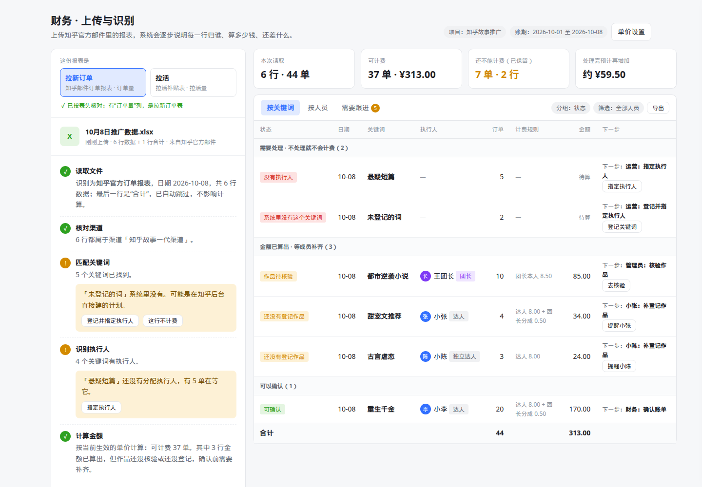
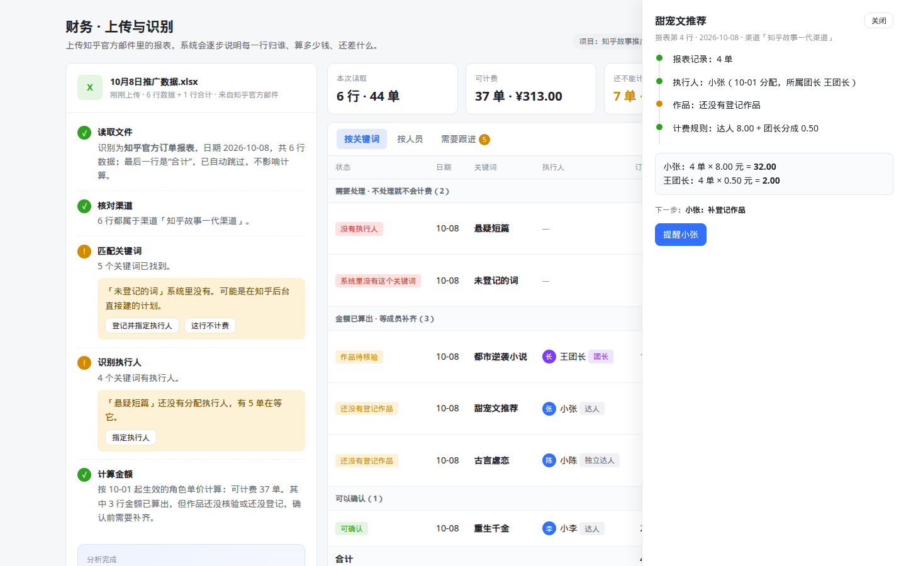
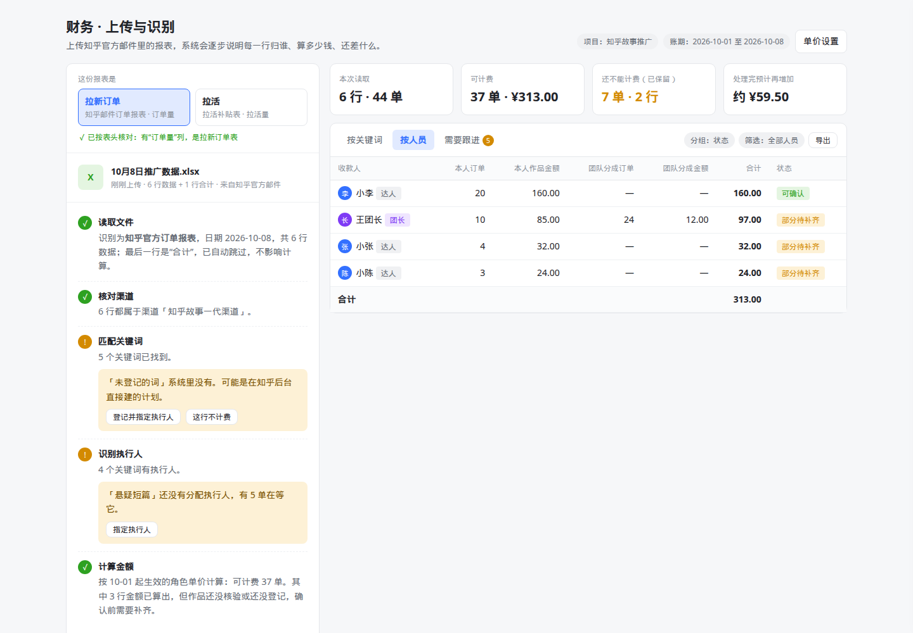

# 报表上传与归因：问题诊断与体验优化方案（待审核）

日期：2026-10-08
状态：方案稿，未改动业务代码
适用代码版本：main @ 5ff5794
关联文档：《平台体验与财务链路改造方案_待审核_2026-10-08》（下称“平台方案”）、《财务与收益链路改造计划_待审核_2026-10-08》（下称“财务方案”）
交互原型：`prototypes/report-analysis/index.html`（浏览器直接打开；末尾加 `?done` 跳过动画）

标注约定同平台方案：【已核实】【待核实】【待确认】【待补充】。

---

## 0. 结论

1. **“传完分析完看不到钱”不是偶发问题，而是设计如此**：只要一行数据有任何一个条件不满足，比如没有执行人、执行人“开始使用”的日期晚于报表日期、缺单价，这一行就不会出现在账单里，页面也不说明原因。实测中，6 行报表有 1 行（5 单）就这样消失了【已核实】。
2. **限制太多，而且很多是死路**：
   - 首次上传会自动锁定一个永远不能改的“生效日”，此后更早日期的报表整份拒收。
   - 被拒后系统让你去“历史邮件 / Excel 导入”，但那里对这些数据**永远不会算钱**。
   - 报表里多一行“合计”，整份文件被拒。
   【均已核实】
3. **交互是给开发者看的**：待办只显示问题文字，修复要自己去别的标签页找；“重新计算”还要手写理由；看不到每一行的计算过程。
4. 优化方向：**上传后像智能体分析文件一样，一步步告诉你“读到了什么、对上了什么、哪里需要你拍板”；结果用多维表格展示，每一行都写清“归谁、算多少、下一步谁做什么”，问题就地处理、自动重算。** 引擎层修掉 12 处缺陷（第 2 节），其中 4 处会直接导致钱丢失或流程走不下去。

---

## 1. 为什么传完看不到钱

### 1.1 一行数据要算出钱，必须同时满足 7 个条件

| 顺序 | 条件 | 不满足时的原因码 | 现在页面上能看到吗 | 实际最常见的触发场景 |
| --- | --- | --- | --- | --- |
| 1 | 报表里的渠道名称和系统登记的完全一致，且登记日期不晚于报表日期 | `CHANNEL_UNMAPPED` | 只显示“还有 N 项需要处理” | 渠道名多一个空格；渠道登记晚于报表日期 |
| 2 | 关键词在系统里存在且唯一 | `KEYWORD_UNKNOWN` | 同上 | 计划是在知乎后台直接建的 |
| 3 | 关键词有执行人，且执行人已“开始使用” | `BINDING_MISSING` | **看不到** | 管理员建的词没分配；团长领了没指派；达人没点“开始使用” |
| 4 | “开始使用”的日期不晚于报表日期 | `PERIOD_AMBIGUOUS` | **看不到** | 达人先发作品、后在系统里登记，登记之前几天的订单全部作废 |
| 5 | 报表没有风险判定 | `RISK_REVIEW_REQUIRED` | 显示为待办，但**无法解除** | 知乎标了风险 |
| 6 | 有订单量 | `REPORT_INCOMPLETE` | **看不到** | 只上传了搜索报表 |
| 7 | 每条付款路径都有且只有一条生效的单价（按“推广任务 × 具体收款人”逐个设置） | `PRICE_MISSING / PRICE_OVERLAP` | **看不到** | 新成员加入没设价；直属达人（上级是管理员）永远缺价 |

依据：`facts.ts` 的 `processBatch()` 第 331–347 行、`attribute()` 第 252–265 行，`workbench.ts` 的 `overview()` 第 81 行（没有收款义务就不生成明细行）【已核实】。

即使 7 个条件都满足，钱算出来了，还有两道关：作品未核验通过时不能确认；确认后还要等财务“开放款项”才变成可提现。这两道是合理的业务控制，但页面没有讲清楚，用户会以为“没钱”。

### 1.2 实测复现

本地环境（平台方案附录 A），6 行报表共 44 单：

| 关键词 | 订单 | 结果 | 页面表现 |
| --- | --- | --- | --- |
| 都市逆袭小说、重生千金、甜宠文推荐、古言虐恋 | 37 | 算出 ¥313 | 正常显示，其中 3 行“等待作品提交成功” |
| 悬疑短篇（未分配） | 5 | `BINDING_MISSING` | **不出现在任何列表里**；订单数却计入顶部“订单数 42” |
| 未登记的词 | 2 | `KEYWORD_UNKNOWN` | 只显示“还有 1 项需要处理” |

另外补测了 4 种常见情况：

| 情况 | 结果 |
| --- | --- |
| 上传昨天的数据（首次上传后） | **整份拒收**：“早于新归因规则 2026-10-08 的生效日期，请到历史邮件 / Excel 导入页面处理” |
| 报表末尾有一行“合计” | **整份拒收**：“有 1 行无法识别：3 行：业务日期不合法” |
| 渠道名称“知乎故事 一代渠道”（多一个空格） | 这一行进入 `CHANNEL_UNMAPPED`，需要去渠道设置里新建对应关系 |
| 同一文件再传一次 | 正确识别为重复，打开原结果 |

---

## 2. 引擎缺陷与漏洞清单

严重程度：**高**表示会丢钱、算错钱或流程走不下去；**中**表示需要人工绕路；**低**表示体验或维护问题。平台方案 6.2 节的 F1–F9 仍然有效，这里只列新发现的问题，最后一列标出重叠关系。

| 编号 | 严重 | 问题 | 依据 | 建议 |
| --- | --- | --- | --- | --- |
| E1 | 高 | **首次上传自动锁定生效日，且永远不能移动**。生效日取第一份报表的最早日期，此后更早日期的数据整份拒收。旧数据入口确认导入时也会同样设定 | `workbench.ts` 第 46–47 行；`cutover.ts` 第 23 行“已登记的日期边界不可移动”；`data-import.service.ts` 第 1045 行 | 取消“首次上传即锁定”；改为按日期判断是否属于旧系统已结算周期（见 5.3 节） |
| E2 | 高 | **历史周期的数据进入死胡同**。被拒后引导去“历史邮件 / Excel 导入”，但这个入口对早于生效日的数据只写入 `attribution_tasks`，代码注释写明“不执行归因计算、不写入 earnings”，也没有任何代码处理这张表 | `data-import.service.ts` 第 722–723、1039–1044、1160–1162 行；全仓库只有插入和计数 | 合并为一个上传入口；历史已结算日期只读展示，其余正常计算 |
| E3 | 高 | **任何一行有问题，整份文件拒收**，包括“合计”行、空行以外的说明行 | `workbench.ts` 第 38–43 行 | 好的行照常处理，有问题的行单独列出原因；“合计 / 总计 / 小计”等汇总行自动跳过并告知 |
| E4 | 高 | **“开始使用”的日期就是归属生效日**。执行人先发作品、后在系统登记，登记之前的订单全部判为 `PERIOD_AMBIGUOUS`，且页面看不到 | `resources.ts` 第 548 行、`compositions.service.ts` `planOwner()`，`activated_on = businessDay()`；`facts.ts` 第 254 行 | 生效日改为“分配日期”（`assigned_at`），或作品的发布时间（`compositions.release_time`），两者取早；仍早于这两个日期的才进入待处理（见 5.4 节） |
| E5 | 中 | 渠道名称精确匹配，不处理空格、全角半角；自动建的渠道对应关系生效日为建立当天 | `facts.ts` 第 326–330 行；`plan-pool.ts` 第 53 行 `effective_from=CURDATE()` | 匹配前统一去空格和全角字符；首次建立对应关系时生效日取该渠道最早关键词的日期；匹配不上时给出最相近的候选 |
| E6 | 中 | 关键词精确匹配，匹配不上时没有任何候选 | `facts.ts` 第 343 行 | 同 E5，给出相近关键词候选 |
| E7 | 中 | 风险判定无法解除：命中后不计价，“重试”被禁止，只能等上游更正报告 | `facts.ts` 第 255、539 行 | 照常计价但阻止确认；增加“人工核实通过”动作并记录审计（财务方案 V7） |
| E8 | 中 | 待办的修复入口分散：渠道去“渠道与任务”，关键词去“关键词”，单价去“定价规则”，回来再点“资料已补齐，重新计算”，还必须手写理由 | `Issues.vue` | 待处理行内直接给出修复动作，修复后自动重算，不要求填写理由（系统自动记录） |
| E9 | 中 | 同一天同一关键词出现两个不同的订单数时，整条事实进入“报表更正待核对”，但页面只显示“待财务核对报表更正”，看不到两个数值 | `facts.ts` 第 369、386 行；实测 S3 | 在行内并列显示“原值 3 单 / 新值 1 单”，按钮“用新值 / 保留原值” |
| E10 | 低 | 旧数据入口转入新引擎时，静默跳过缺日期、渠道或关键词的行；日期解析靠“T15:59:17Z”特征修正 | `data-import.service.ts` 第 993–1011、1059 行 | 随 E2 合并入口后删除 |
| E11 | 低 | 顶部“订单数”包含算不出钱的行，而金额不包含，两者对不上且没有解释 | `workbench.ts` 第 73 行 | 拆为“可计费 X 单 / 还不能计费 Y 单” |
| E12 | 低 | 关键词“已登记作品”按“开始使用”显示，不看实际作品数 | `Keywords.vue` 第 75 行 | 按作品数显示 |
| — | — | 缺归属行不显示、事实级原因码不写待办、补齐后不自动重算、重试按钮误标已解决、补录归属被“未使用”检查拦截、补登记关键词会重复推送知乎 | — | 见平台方案 F1、F7、F8 及财务方案 1.2 节 |

---

## 3. 新的处理原则

这几条是硬规则，所有上传类功能都适用，也写进了开发规范：

1. **不整份拒收。** 只有文件本身打不开、不是表格、完全没有可识别的表头时才拒收；其他问题按行处理。
2. **不静默丢弃。** 读到的每一行都必须在结果表里出现，并带一个明确状态。
3. **不设死路。** 任何“不能计费”的状态都必须有一个能在当前页面完成的处理动作，或者明确写出“谁在什么时候处理”。
4. **修一处，自动重算。** 指定执行人、确认渠道、补作品、调单价之后，受影响的行自动重算，不需要重新上传，也不需要填写理由。
5. **一个入口。** 新旧报表、任何日期的报表都从同一个地方上传；系统自己判断该怎么处理。
6. **每一笔钱可以点开看来源。** 报表第几行、执行人是谁、按哪条规则、怎么算的。
7. **金额只由确定的规则计算。** 界面可以做得像智能体，但钱的计算、归属判断不交给 AI 模型；AI 最多用于“解释”和“推荐候选”，且推荐必须由人确认。

---

## 4. 新交互：分析过程 + 多维表格

### 4.1 整体布局

一个页面分左右两栏（手机宽度上下排列），见原型截图：

- **左栏：分析过程**。上传后逐步显示分析进度和结论；需要人拍板的地方，直接在步骤里给出按钮。
- **右栏：结果表**。顶部 4 个关键数字，下方是多维表格，有“按关键词 / 按人员 / 需要跟进”三个视图。



### 4.2 分析步骤

| 步骤 | 系统自动做什么 | 需要人决定时怎么问 | 正常时的一句话结论示例 |
| --- | --- | --- | --- |
| 1 读取文件 | 判断报表类型（订单 / 搜索 / 综合）、识别表头、读取日期范围；自动跳过空行和“合计”类行 | 表头完全认不出时：“没找到‘关键词’这一列，你的表格里是哪一列？”并列出表头让人点选 | “识别为知乎官方订单报表，日期 10-08，共 6 行；最后一行是合计，已跳过” |
| 2 核对渠道 | 统一空格和全角字符后匹配渠道 | “「知乎故事 一代渠道」没对上，看起来是「知乎故事一代渠道」”，按钮【是同一个】【是新渠道】 | “6 行都属于渠道「知乎故事一代渠道」” |
| 3 匹配关键词 | 统一空格和全角字符后匹配 | “「未登记的词」系统里没有，可能是在知乎后台直接建的”，按钮【登记并指定执行人】【这行不计费】；有相近词时先问【是不是「××」】 | “5 个关键词已找到” |
| 4 识别执行人 | 查关键词当天的执行人和所属团长 | “「悬疑短篇」还没有执行人，有 5 单在等它”，按钮【指定执行人】 | “4 个关键词有执行人：王团长 1 个、团队达人 2 个、独立达人 1 个” |
| 5 核对作品 | 查作品是否登记、是否核验通过 | 不需要当场决定，归到“需要跟进”，并写明谁来处理 | “1 个可以确认；3 个金额已算出，在等作品登记或核验” |
| 6 计算金额 | 按生效的单价规则计算每个收款人的金额 | 缺单价时：“达人单价还没设置”，按钮【去设置单价】（抽屉打开） | “按 10-01 起生效的角色单价，可计费 37 单，¥313.00” |
| 结论 | 汇总 | — | “已算出 ¥313.00，其中 ¥170.00 现在就能确认；还有 5 件事：2 件需要运营处理，3 件在等成员补作品或核验” |

步骤状态只有 4 种：进行中（蓝色转动）、完成（绿色勾）、需要你看一下（橙色感叹号）、失败（红色叉，只用于文件打不开这类情况）。

处理时间超过 2 秒时显示进度（“正在核对第 1,200 / 3,000 行”）；关掉页面再回来，能看到同一次分析的进度和结果。

### 4.3 结果表（多维表格）

参照飞书多维表格的表达方式：

- **视图**：按关键词（默认）、按人员、需要跟进（带数量角标）。
- **分组**：默认按状态分为三组，即“需要处理（不处理就不会计费）”“金额已算出，等成员补齐”“可以确认”。每组标题显示行数。
- **列（按关键词视图）**：状态标签、日期、关键词、执行人（头像 + 角色标签）、订单、计费规则、金额、下一步（“谁：做什么”+ 按钮）。
- **列（按人员视图）**：收款人、本人作品订单、本人作品金额、团队分成订单、团队分成金额、合计、状态。每个人单独一行，不再把团队达人的金额并入团长。
- **底部合计行**：订单和金额自动合计，随筛选变化。
- **筛选与分组**：状态、人员、团长、日期；“导出”导出当前视图。
- **点开一行**：右侧抽屉显示计算过程，包括报表第几行、执行人从哪天开始、作品情况、计费规则，以及“4 单 × 8.00 元 = 32.00”这样的公式；抽屉底部是这一行的下一步按钮。
- **手机宽度**：表格变成卡片，每张卡片包括关键词、状态、执行人、订单和规则、下一步、金额。





### 4.4 待处理动作清单

| 状态（页面用词） | 原因码 | 下一步（谁：做什么） | 按钮与结果 |
| --- | --- | --- | --- |
| 渠道没对上 | `CHANNEL_UNMAPPED / CHANNEL_AMBIGUOUS` | 运营：确认渠道 | 【是「××」】保存对应关系，生效日取报表日期；【新渠道】打开新建渠道抽屉 |
| 系统里没有这个关键词 | `KEYWORD_UNKNOWN` | 运营：登记并指定执行人 | 抽屉内填写执行人，按“历史任务”登记，**不向知乎推送** |
| 没有执行人 | `BINDING_MISSING`（没有绑定） | 运营：指定执行人 | 选人；生效日默认为报表日期；调用补录归属接口（平台方案 F1） |
| 执行人还没开始 | `BINDING_MISSING`（预留或未开始） | 团长：分配执行人 / 达人：提交作品 | 团长预留的词：【分配给自己】【分配给成员】；达人未开始：提交作品后自动开始 |
| 执行人从 ×× 日开始，早于这天的订单待确认 | `PERIOD_AMBIGUOUS` | 运营：确认从哪天算 | 【从报表日期算】二次确认并写审计（财务方案事项 15） |
| 还没有登记作品 / 作品待核验 | 绑定未核验 | 达人：补登记作品 / 团长或管理员：核验作品 | 【提醒他】发送站内通知；【去核验】抽屉打开作品 |
| 单价还没设置 | `PRICE_MISSING / PRICE_OVERLAP` | 财务：设置单价 | 打开单价设置抽屉；采用角色单价后，只有整个角色缺价时才出现 |
| 两份报表数字不同 | `SOURCE_REVISION_PENDING` | 财务：选用哪个数 | 行内并列“原值 / 新值”，【用新值】【保留原值】 |
| 知乎标了风险 | `RISK_REVIEW_REQUIRED` | 运营：核实 | 【核实没问题】填写一句说明；【确实有问题】这行不计费 |
| 只有搜索数据，没有订单 | `REPORT_INCOMPLETE` | 财务：补传订单报表 | 说明需要哪种报表；补传后自动合并 |
| 历史已结算 | 旧系统已结算的日期 | 无需处理 | 只读显示，说明“这一天已在旧系统结算，不重复计算” |

### 4.5 文案对照

| 现在 | 改为 |
| --- | --- |
| 已读取 5 条有效业务记录，订单数：42 · 当前应付：¥313.00，还有 1 项需要处理，未处理前不会计入应付金额 | 读取 6 行、44 单。可计费 37 单 ¥313.00；还有 7 单在等处理，处理后预计增加约 ¥59.50 |
| 等待作品提交成功，系统将自动核对归属 | 下一步：小张补登记作品 |
| 待运营补齐归属或定价资料 | 下一步：运营指定执行人 |
| 这份报表包含……的历史数据，早于新归因规则……请到“历史邮件 / Excel 导入”页面处理 | （不再出现。历史已结算的日期在表中只读标注，其他日期正常计算） |
| 有 1 行无法识别：3 行：业务日期不合法。请按提示修正后重新上传 | 最后一行是“合计”，已自动跳过 |
| 关键词尚未分配或使用 | 没有执行人 |
| 资料已补齐，重新计算（并要求填写处理说明） | （不需要。处理完自动重算） |
| 报表问题与更正（折叠区） | 需要跟进（视图，带数量角标） |

### 4.6 特殊情况

| 情况 | 处理 |
| --- | --- |
| 同一文件再传一次 | 结论区显示“这份文件 10-08 已经分析过”，直接打开当时的结果，并按最新资料刷新 |
| 补传了同一天的更正报表 | 只影响变化的行；变化行标记“更正”，原值和新值并列显示 |
| 一次传多份文件 | 每份文件一条分析记录，结果表合并显示，可按文件筛选 |
| 文件很大（几千行） | 分析在后台进行，显示进度；页面可以关闭，回来继续看 |
| 包含已在旧系统结算的日期 | 这些行只读，标注“已在旧系统结算”，其余行正常计算 |
| 报表日期在未来 | 这一行标注“日期在未来”，不计费；其余行照常 |

---

## 5. 后端支撑

### 5.1 分析记录

增加“分析记录”，让前端可以展示步骤式进度和结论，而不是只拿到一个批次编号：

```ts
// GET /api/v1/modules/zhihu/imports/:id/analysis  （示意）
interface ImportAnalysis {
  id: string;
  fileName: string;
  status: 'running' | 'needs_input' | 'done' | 'failed';
  progress?: { done: number; total: number };
  steps: {
    key: 'read' | 'channel' | 'keyword' | 'executor' | 'work' | 'amount';
    status: 'running' | 'done' | 'ask' | 'failed';
    summary: string;                 // 一句话结论，直接展示
    asks?: { id: string; text: string; options: { key: string; label: string }[] }[];
  }[];
  conclusion?: { billableOrders: number; billableAmount: string; confirmableAmount: string; pendingOrders: number; estimatedAmount: string; todo: { actor: string; count: number }[] };
}
// POST /api/v1/modules/zhihu/imports/:id/answers  { askId, option }  → 执行对应动作并自动重算
```

- 结果表的数据来自平台的收益明细（平台方案 6.1 节）加上待处理行；每一行都有统一状态和“下一步”。
- 前端每秒轮询一次，结束后停止；后续可改为服务器推送。【待补充：D10 字段定义】
- `summary` 和 `asks.text` 由后端按固定模板生成，前端不拼接业务判断。

### 5.2 解析器

- **汇总行识别**：关键词或渠道列为“合计 / 总计 / 小计 / 汇总”，或日期列为这些字样、其余维度为空的行，标记为“已跳过（汇总行）”，不报错。
- **逐行保留错误**：有问题的行以“无法读取”状态进入结果表，并给出原因，例如“第 9 行日期写成了‘10月8号’”；其他行照常处理（E3）。
- **名称归一化**：渠道和关键词匹配前统一去除首尾和中间多余空格，全角转半角；原文保留用于展示（E5、E6）。
- **相近候选**：匹配失败时，按编辑距离从当前项目中找最多 3 个候选，供“是不是 ××”提问使用。
- **表头不确定时问人**：给出识别到的表头，让人点选对应列，并记住这份模板，下次同样的表头自动识别。【待核实：V5 真实知乎导出表的表头】

### 5.3 取消“首次上传锁定生效日”（E1、E2）

- 不再在首次上传时自动写入不可移动的生效日。
- 新的判断规则：**某一天在旧系统中已经有结算或收益记录，这一天就属于“历史已结算”**，只读展示；没有的日期一律按新规则计算。依据是旧表 `earnings`、`daily_metrics` 和已确认的旧导入记录，现有 `configureRoute()` 已经在查这些表【已核实：`cutover.ts` 第 25–40 行】。
- 现有 `zh_engine_routes` 的 `trial / enabled / stopped` 改为项目设置里的“计算开关”：试运行（可算不可确认）、正式、暂停。只有管理员在项目设置中修改，日常上传不触碰。
- “历史邮件 / Excel 导入”入口下线；旧路由跳转到统一上传页。【待确认：B1】

### 5.4 归属生效日规则（E4）

- 生效日从“点开始使用 / 首次登记作品的那天”改为 **min(分配日期, 首个作品的发布时间)**。
- 报表日期早于这个日期的行，进入“执行人从 ×× 日开始，早于这天的订单待确认”，由运营决定是否从报表日期起算。
- 已确认的账不受影响；改规则后对未确认事实执行一次重算。【待确认：B2】

### 5.5 其余改动

与平台方案 6.2 节合并实施：待处理全部写入待办表并在原因消除后自动关闭；指定执行人、确认渠道、核验作品、发布单价时自动重算未确认的事实；补录归属接口；历史任务登记不推送知乎；风险判定改为只阻止确认（E7）。

---

## 6. 实施安排

本方案并入平台方案的阶段 2、3：

| 阶段 | 本方案内容 |
| --- | --- |
| 阶段 0（快速清理） | E3 汇总行跳过；E11 订单数拆分；E12 文案；缺归属行在账单里显示为“待处理” |
| 阶段 2（规则与数据） | E1、E2 取消锁定、合并入口；E4 生效日规则；E5、E6 归一化与候选；E7 风险；分析记录接口；自动重算 |
| 阶段 3（页面） | 分析过程面板、多维表格结果、行内处理动作、计算过程抽屉、手机卡片布局 |

分析过程面板和多维表格做成平台共享组件（`packages/shared-components`），后续批量导入作品、其他项目的数据同步也使用同一套组件。

---

## 7. 验收用例

| 编号 | 场景 | 期望 |
| --- | --- | --- |
| R1 | 上传实测报表（6 行，含 1 行未分配、1 行未登记） | 6 行全部出现在结果表；可计费 37 单 ¥313.00；2 行“需要处理”，各带一个处理按钮 |
| R2 | 报表末尾有“合计”行 | 自动跳过并在第 1 步说明，不拒收 |
| R3 | 渠道名称多一个空格 | 自动匹配为同一渠道，或给出候选询问；不需要去渠道设置 |
| R4 | 首次上传后再上传更早日期的报表 | 正常计算；旧系统已结算的日期只读标注 |
| R5 | 在结果表对“悬疑短篇”指定执行人小李 | 自动重算；小李 +40.00，王团长 +2.50；不需要重新上传、不需要填写理由；关键词不被锁成“历史计划” |
| R6 | 达人 10-05 发布作品、10-07 才在系统登记，10-05 的订单 | 正常计费（按发布时间起算） |
| R7 | 同一天同一关键词两份报表数值不同 | 行内并列显示两个数值，选择后生成更正 |
| R8 | 知乎标了风险的行 | 金额照常显示，状态“待核实”，运营核实后可以确认 |
| R9 | 3,000 行报表上传后关闭页面 | 回到页面能看到同一次分析的进度和结论 |
| R10 | 每一笔金额 | 都能点开看到报表行号、执行人、规则和公式 |
| R11 | 手机宽度（375px） | 分析过程和结果卡片都没有横向溢出 |
| R12 | 关闭知乎模块，启用示例项目 | 同一套分析面板和结果表可以展示示例项目的同步结果（平台方案 P2） |

---

## 8. 待确认事项

| 编号 | 问题 | 建议默认值 | 结论 |
| --- | --- | --- | --- |
| B1 | “历史邮件 / Excel 导入”是否下线，统一到一个上传入口 | 下线，旧地址跳转 | |
| B2 | 归属生效日是否改为“分配日期与首个作品发布时间取早” | 是 | |
| B3 | 渠道名称只差空格或全角时，是否自动视为同一渠道 | 自动视为同一渠道，并在第 2 步说明，可撤销 | |
| B4 | 关键词有相近候选时，是否允许一键确认“就是它” | 允许，记录审计 | |
| B5 | “历史已结算”的判断依据 | 该日期在旧系统已有结算或收益记录 | |
| B6 | 风险判定人工核实后是否可以计费 | 可以，需填写一句核实说明 | |
| B7 | 是否需要“提醒他”这类站内通知 | 需要；首期只做站内通知，不发短信 | |
| B8 | 以后是否接入邮箱自动收取知乎报表 | 本期不做，保留扩展 | |
